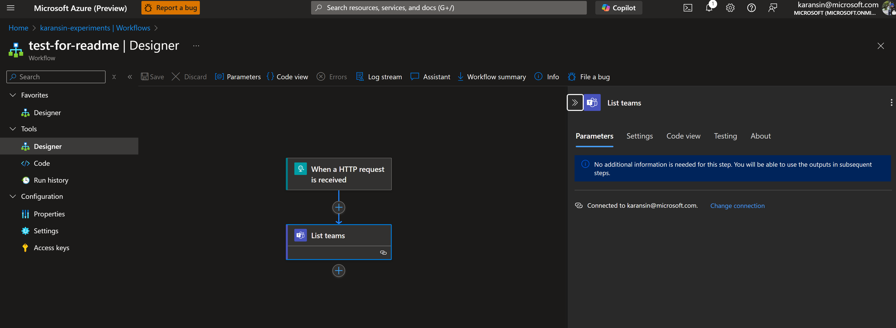
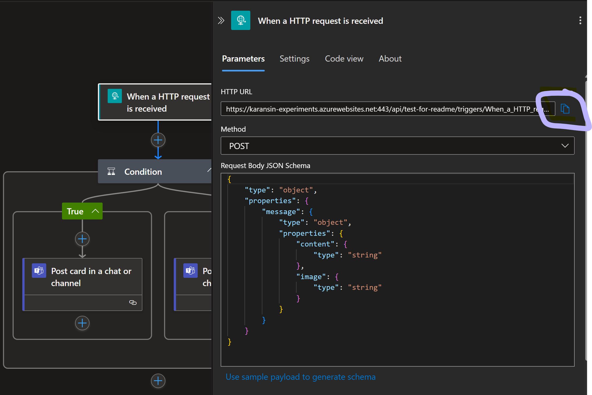

# Local Settings
Update the local.settings.json with the following:

```json
{
    "IsEncrypted": false,
  "Values": {
    "AzureWebJobsStorage": "UseDevelopmentStorage=true",
    "FUNCTIONS_WORKER_RUNTIME": "dotnet-isolated",
    "Environment": "Development",
    "AzureOpenAIEndpoint": "<your_endpoint>", // e.g. https://pbatum-ai-services-sfi2.cognitiveservices.azure.com/,    
    "AzureOpenAIDeployment": "gpt-4o",
    "OpenAIAPI_KEY": "<your_openai_key>", // remove this completely to use RBAC with default azure credentials
    "TeamsPostMessageEndpoint": "<logic app http trigger endpoint>",
    "ApprovalUrl": "https://localhost:7268/?action_name={0}"
  }
}
```


## Logic App Teams Integration
To receive messages from the bot in Teams, create a new Logic App (Standard) workflow that is Stateful.

We first go through UX to authorize the Teams connector, and use JSON for the rest.

1. Add a new workflow
2. Add a trigger : When a HTTP request is received
3. Add a 'List Teams' action and create/authorize the new connection (we called ours 'teams')
4. Click 'save'



Now go to 'code view' and replace the full JSON with the real workflow. Replace 'karansin@microsoft.com' with your email so the messages go to you.

```json
{
    "definition": {
        "$schema": "https://schema.management.azure.com/providers/Microsoft.Logic/schemas/2016-06-01/workflowdefinition.json#",
        "actions": {
            "Condition": {
                "type": "If",
                "expression": {
                    "and": [
                        {
                            "not": {
                                "equals": [
                                    "@empty(triggerBody()?['message']?['image'])",
                                    true
                                ]
                            }
                        }
                    ]
                },
                "actions": {
                    "Post_card_in_a_chat_or_channel": {
                        "type": "ApiConnection",
                        "inputs": {
                            "host": {
                                "connection": {
                                    "referenceName": "teams"
                                }
                            },
                            "method": "post",
                            "body": {
                                "recipient": "karansin@microsoft.com",
                                "messageBody": "{  \n  \"type\": \"AdaptiveCard\",  \n  \"body\": [  \n    {  \n      \"type\": \"TextBlock\",  \n      \"text\": \"@{triggerBody()?['message']?['content']}\",\n      \"wrap\": true\n    },  \n    {  \n      \"type\": \"Image\",  \n      \"url\": \"@{triggerBody()?['message']?['image']}\"\n    }  \n  ],  \n  \"actions\": [  \n    {  \n      \"type\": \"Action.OpenUrl\",  \n      \"title\": \"Open Azure Portal\",  \n      \"url\": \"https://www.example.com\"  \n    }  \n  ],  \n  \"$schema\": \"http://adaptivecards.io/schemas/adaptive-card.json\",  \n  \"version\": \"1.2\"  \n}"
                            },
                            "path": "/v1.0/teams/conversation/adaptivecard/poster/Flow bot/location/@{encodeURIComponent('Chat with Flow bot')}"
                        }
                    }
                },
                "else": {
                    "actions": {
                        "Post_message_in_a_chat_or_channel": {
                            "type": "ApiConnection",
                            "inputs": {
                                "host": {
                                    "connection": {
                                        "referenceName": "teams"
                                    }
                                },
                                "method": "post",
                                "body": {
                                    "recipient": "karansin@microsoft.com",
                                    "messageBody": "<p class=\"editor-paragraph\">@{triggerBody()?['message']?['content']}</p>"
                                },
                                "path": "/beta/teams/conversation/message/poster/Flow bot/location/@{encodeURIComponent('Chat with Flow bot')}"
                            }
                        }
                    }
                },
                "runAfter": {}
            }
        },
        "contentVersion": "1.0.0.0",
        "outputs": {},
        "triggers": {
            "When_a_HTTP_request_is_received": {
                "type": "Request",
                "kind": "Http",
                "inputs": {
                    "method": "POST",
                    "schema": {
                        "type": "object",
                        "properties": {
                            "message": {
                                "type": "object",
                                "properties": {
                                    "content": {
                                        "type": "string"
                                    },
                                    "image": {
                                        "type": "string"
                                    }
                                }
                            }
                        }
                    }
                }
            }
        }
    },
    "kind": "Stateful"
}
```

5. Save the workflow and get the HTTP endpoint from the trigger. That becomes 'TeamsPostMessageEndpoint' in the JSON at the beginning of this README.




## To send a mesage to the bot
In teams, this can be accomplished with a second logic app that reads messages from Teams and proxies them back to the bot, but so far that is just set up for the hosted workflow.
Locally you can POST:

POST http://localhost:7253/api/ProcessMessageFunction_HttpStart
Request Body : 
{
  "content": "Hi, please start monitoring subscription your_sub_name"
}