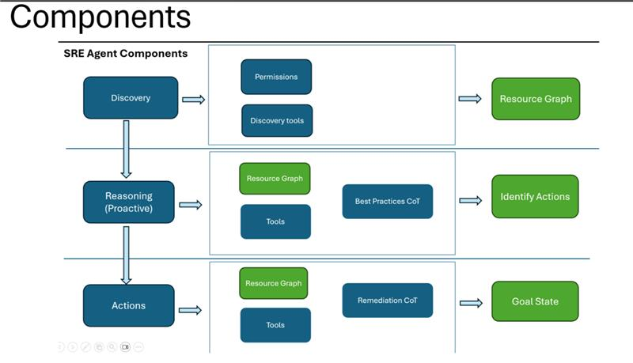
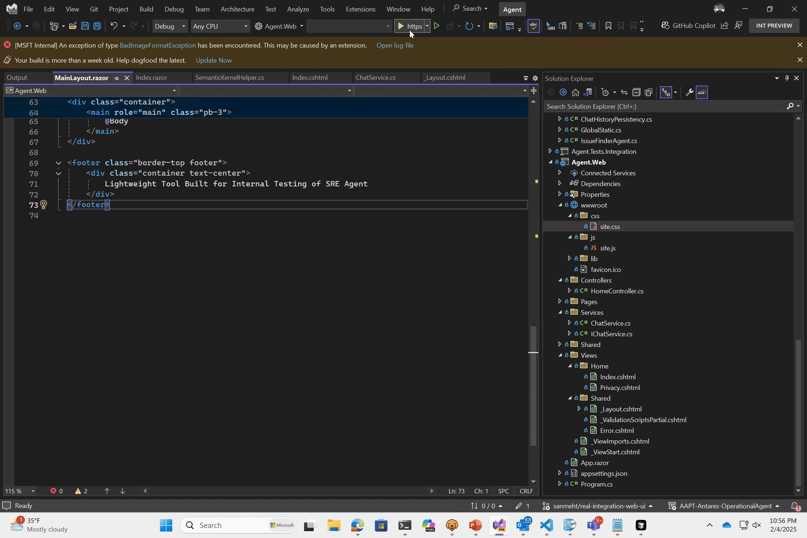

# SRE Agent

## Introduction

Azure SRE Agent is a unified agentic platform for monitoring and troubleshooting Azure applications and services. Get started quickly with the `Agent.Web` project and extend functionality using the plugins and helpers in `Agent.Core`.



## Getting Started

1. **Configure the Agent.Web Project**  
   In the `Agent.Web` project, add an `appsettings.Development.json` file with the following configuration:

   ```json
   {
     "Azure": {
       "OpenAI": {
         "DeploymentName": "gpt-4o",
         "Endpoint": "<open-ai-endpoint>",
         "ApiKey": "<azure-openai-key>"
       }
     }
   }
   ```

2. **Launch the Solution**  
   Navigate to the directory containing the solution file (`Agent.sln`) and open it with your preferred IDE (e.g., Visual Studio). For example, in a PowerShell prompt:

   ```powershell
   .\AAPT-Antares-OperationalAgent\src\Agent>Agent.sln
   ```

3. **Run the Application**  
   Build and run the solution. The `Agent.Web` project will start a test chat client that will use your identity to access Azure resources.
   
   

   Happy monitoring and troubleshooting!

## Build and Test

TODO: Describe and show how to build your code and run the tests.

## To configure the Graph Database
Following the steps found here: https://learn.microsoft.com/en-us/azure/cosmos-db/gremlin/quickstart-dotnet#create-vertices

1. Create shell variables for accountName, resourceGroupName, and location.
```powershell
# Variable for resource group name
resourceGroupName="msdocs-cosmos-gremlin-quickstart"
location="westus"

# Variable for account name with a randomly generated suffix

let suffix=$RANDOM*$RANDOM
accountName="msdocs-gremlin-$suffix"
```

2. If you haven't already, sign in to the Azure CLI using `az login`.

3. Use `az group create` to create a new resource group in your subscription.
```powershell
az group create \
    --name $resourceGroupName \
    --location $location
```

4. Use `az cosmosdb create` to create a new API for Gremlin account with default settings.
```powershell
az cosmosdb create \
    --resource-group $resourceGroupName \
    --name $accountName \
    --capabilities "EnableGremlin" \
    --locations regionName=$location \
    --enable-free-tier true
```

5. Get the API for Gremlin endpoint NAME for the account using `az cosmosdb show`.
```powershell
az cosmosdb show \
    --resource-group $resourceGroupName \
    --name $accountName \
    --query "name"
```

6. Find the KEY from the list of keys for the account with `az cosmosdb keys list`.
```powershell
az cosmosdb keys list \
    --resource-group $resourceGroupName \
    --name $accountName \
    --type "keys" \
    --query "primaryMasterKey"
```

7. Record the NAME and KEY values. You use these credentials later.

8. Create a database named `resourcegraph` using `az cosmosdb gremlin database create`.
```powershell
az cosmosdb gremlin database create \
    --resource-group $resourceGroupName \
    --account-name $accountName \
    --name "resourcegraph"
```

9. Create a graph using `az cosmosdb gremlin graph create`. Name the graph `resources`, then set the throughput to 400, and finally set the partition key path to `/resourceType`.
```powershell
az cosmosdb gremlin graph create \
    --resource-group $resourceGroupName \
    --account-name $accountName \
    --database-name "resourcegraph" \
    --name "resources" \
    --partition-key-path "/resourceType" \
    --throughput 400
```

10. Add a Gremlin section in appsettings.Development.json that looks like the following:

Make sure to match the case for `Database` and `Collection`. Otherwise you'll get an error `["Owner resource does not exist"]`

```json
 "Gremlin": {
   "AccountName": "<<ACCOUNTNAME>>",
   "AccountKey": "<<<ACCOUNTKEY>>",
   "Database": "resourcegraph",
   "Collection": "resources"
 }
```
## Manually Deploy FirstPartyAgent to ACA using azd
TODO: add cosmosdb(gremlin) to bicep files
### Preparation
Please install:
1. az
1. azd
1. docker

Because we have internal-only dependencies, please make sure you have access to internal Nuget feed when building the docker image.
### deployment definition files
Everything lives in src/Deployment/FirstPartyAgent

1. azure.yaml -> used by azd
1. infra folder -> bicep files
1. Dockerfile

### deployment procedures
A subscription called [Container Apps Operational Agent (be8d491e-109c-4ee1-aaee-dc7615af0a42)](https://ms.portal.azure.com/#@microsoft.onmicrosoft.com/resource/subscriptions/be8d491e-109c-4ee1-aaee-dc7615af0a42/overview) is crated for ACA agent. Please select it when azd asks for a subscription if you want to deploy to that subscription, e.g. for production deployment.

`azd up` currently reports errors without even building a docker image. so please do the following as a workaround.
1. `cd src/Deployment/FirstPartyAgent`
1. Login to azd using `azd auth login --scope https://management.azure.com//.default`
1. Select your target subscription using `az account set --subscription <target-subscription>`
1. (Only required for first time deployment) Run `azd env new` to create a new azd env.
1. (Only required for first time deployment) Run `azd provision` to provision all azure resources(ACA managed env, ACR, Azure OpenAI, etc.). Pleaes remember to increase the quota of gpt-4o deployment in Azure Portal, or you will get a lot of 429 code when accessing this app.
1. Run `build_and_publish_image.ps1` to build the docker image and push to ACR
1. Run `azd provision`, which will deploy the image built in the previous step.

If you want to deploy to production, please contact yefwuang, zhenquan.xu, xiangy for production azd config files.