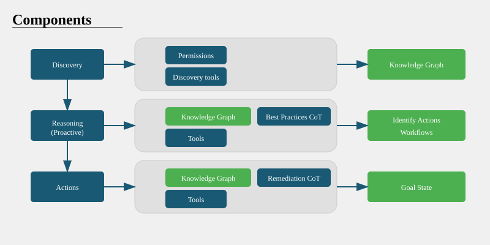

# SRE Agent

## Introduction

Azure SRE Agent is a unified agentic platform for monitoring and troubleshooting Azure applications and services. Get started quickly with the `Agent.Web` project and extend functionality using the plugins and helpers in `Agent.Core`.



## Getting Started

1. **Set the API key for NuGet**  
   We use an internal NuGet source for packages. To restore and build using the `dotnet` CLI, set the API key by running the following command:

   ```
   nuget.exe setApiKey az -Source https://msazure.pkgs.visualstudio.com/Antares/_packaging/antares-websites/nuget/v3/index.json
   ```

   **Tip**  
   If you don't have `nutget` installed in your windows machine, you can download it from https://www.nuget.org/downloads or use `winget` to install it by running `winget install Microsoft.NuGet` in an Administrator shell.

   > **Warning**  
   > Using the cross-platform `dotnet nuget` won't work as it doesn't support setting the API key.

2. **Configure the Agent.Web Project**  
   In the `Agent.Web` project, add an `appsettings.Development.json` file with the following configuration:

   ```json
   {
     "Azure": {
       "OpenAI": {
         "DeploymentName": "gpt-4o",
         "Endpoint": "<open-ai-endpoint>",
         "ApiKey": "<azure-openai-key>"
       }
     }
   }
   ```

2. **Launch the Solution**  
   Navigate to the directory containing the solution file (`Agent.sln`) and open it with your preferred IDE (e.g., Visual Studio):

   ```powershell
   .\AAPT-Antares-OperationalAgent\src\Agent>Agent.sln
   ```

3. **Run the Application**  
   Build and run the solution. The `Agent.Web` project will start a test chat client that will use your identity to access Azure resources.
   
   

## Graph Database Configuration

### Prerequisites
- Azure CLI installed
- PowerShell environment

### Setup Steps

1. **Set Environment Variables**
   ```powershell
   resourceGroupName="msdocs-cosmos-gremlin-quickstart"
   location="westus"
   let suffix=$RANDOM*$RANDOM
   accountName="msdocs-gremlin-$suffix"
   ```

2. **Create Resources**
   - Login to Azure CLI: `az login`
   - Create resource group:
     ```powershell
     az group create --name $resourceGroupName --location $location
     ```
   - Create Cosmos DB account:
     ```powershell
     az cosmosdb create \
         --resource-group $resourceGroupName \
         --name $accountName \
         --capabilities "EnableGremlin" \
         --locations regionName=$location \
         --enable-free-tier true
     ```

3. **Get Credentials**
   - Get API endpoint name:
     ```powershell
     az cosmosdb show --resource-group $resourceGroupName --name $accountName --query "name"
     ```
   - Get primary key:
     ```powershell
     az cosmosdb keys list --resource-group $resourceGroupName --name $accountName --type "keys" --query "primaryMasterKey"
     ```

4. **Create Database and Graph**
   ```powershell
   az cosmosdb gremlin database create \
       --resource-group $resourceGroupName \
       --account-name $accountName \
       --name "resourcegraph"

   az cosmosdb gremlin graph create \
       --resource-group $resourceGroupName \
       --account-name $accountName \
       --database-name "resourcegraph" \
       --name "resources" \
       --partition-key-path "/resourceType" \
       --throughput 400
   ```

5. **Update Configuration**  
   Add to `appsettings.Development.json`:
   ```json
   "Gremlin": {
     "AccountName": "<<ACCOUNTNAME>>",
     "AccountKey": "<<<ACCOUNTKEY>>",
     "Database": "resourcegraph",
     "Collection": "resources"
   }
   ```

## FirstPartyAgent Deployment to ACA

### Prerequisites
- Azure CLI (az)
- Azure Developer CLI (azd)
- Docker
- Access to internal Nuget feed

### Deployment Files
Located in `src/Deployment/FirstPartyAgent`:
- azure.yaml (azd configuration)
- infra folder (bicep files)
- Dockerfile

### Deployment Steps

1. **Preparation**
   - Navigate to deployment directory: `cd src/Deployment/FirstPartyAgent`
   - Login to azd: `azd auth login --scope https://management.azure.com//.default`
   - Select target subscription: `az account set --subscription <target-subscription>`

2. **First-time Deployment**
   - Create new azd environment: `azd env new`
   - Provision Azure resources: `azd provision`
   - Note: Increase gpt-4o deployment quota in Azure Portal to avoid 429 errors

3. **Build and Deploy**
   - Run `build_and_publish_image.ps1` to build and push Docker image
   - Run `azd provision` to deploy the image

For production deployment, contact yefwuang, zhenquan.xu, xiangy for configuration files.

Note: Production deployment should use the subscription "Container Apps Operational Agent (be8d491e-109c-4ee1-aaee-dc7615af0a42)".