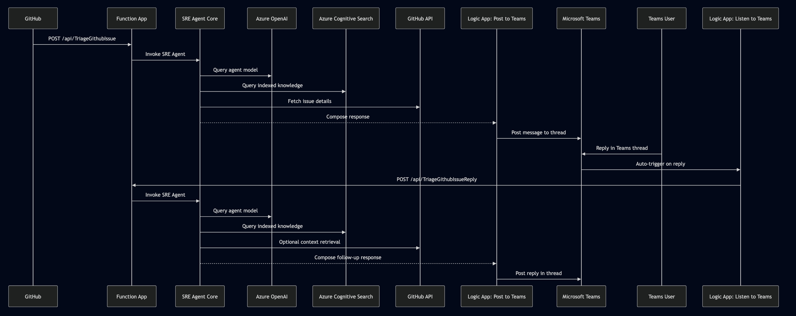

# GitHub Triage SRE Agent

Read me for Github Triage SRE Agent, a first-party agent that uses Azure OpenAI to triage GitHub issues.

# Architecture



## Requirements

### Development Environment

- python
- .NET

### Cloud Resources

- Azure OpenAI Service
  - Used to deploy the OpenAI models the agent will consume
  - Needs to be in `East US` so that we can get a specific model
  - Deploy two models:
    - `gpt-4o`
    - `text-embedding-ada-002`
- Azure Search Service
  - Used to index the GitHub issues to allow for semantic search
- Function App
  - Used to trigger the agent on new GitHub issues & handle replies to user prompts
- Logic App
  - Used to write to a teams channel, and listen to user replies in a teams channel in order to invoke the agent

#### Other Resources

- GitHub PAT with `repo` scope

## Index GH Issues

This script is used to index GitHub issues into Azure Search. It may run for a couple of hours to complete,
depending on the number of issues in the repository.

- `cd src/GitHubIssueIndexer`
- Setup python virtual environment `python -m venv .venv`
- Activate the virtual environment `source .venv/bin/activate`
- Install the requirements `pip install -r requirements`
- Copy the `env` file, renaming it to `.env` and fill in the values
- Run indexing script `python index-gh-issues.py`

## Web App

### NuGet Packages

There are some packages that come from an internal NuGet feed `antares-websites` - this is already configured in the `src/nuget.config` file.
However, you may need to add the credentials for the feed to be able to restore the packages.

One way to do this is to add the credentials to your personal/global `nuget.config` file.
This file is usually located at `~/.nuget/NuGet/NuGet.Config` on Linux and Mac, or `%APPDATA%\NuGet\NuGet.Config` on Windows.

```xml
    <packageSourceCredentials>
    <antares-websites>
        <add key="Username" value="" />
        <add key="ClearTextPassword" value="" />
      </antares-websites>
  </packageSourceCredentials>
```

> Note: Your PAT token for accessing this repo and the nuget feeds should include read/write aceess for the `code` scope, and read access for the `packages` scope.

### AppSettings

Create a new `appsettings.development.json` file in `src/Agent/FirstPartyAgent.Web/` with the following content:

> NOTE: the appsettings property names change all the time, refer to `FirstPartyAgent.Web/appsettings.json` for the latest structure.

```json
{
  "Urls": "http://localhost:7075", // otherwise default is 5000 and clashes with other processes
  "AppSettings": {
    "Core": {
      "Azure": {
        "OpenAI": {
          "Endpoint": "<your-openai-endpoint>", // e.g. https://<your-openai-resource>.openai.azure.com/
          "ApiKey": "<your-openai-key>",
        }
      },
      "External": {
        "GitHub": {
          "PatOverride": "<your-github-pat>",
        },
        "AzureSearch": {
          "SearchServiceUri": "<your-azure-search-endpoint>", // e.g. https://<your-azure-search-resource>.search.windows.net
          "SearchApiKeyOverride": "<your-azure-search-key>",
          "SearchIndexes": [
            {
              "IndexName": "githubissues_azure_azure-functions-host",
              "FieldsToSelectCsv": "id,issueId,issueUrl,owner,repository,title,body,comments,labels,state,descriptiveSummary,createdTimestamp,lastUpdatedTimestamp",
              "SemanticSearchEnabled": false,
              "VectorSearchEnabled": true,
              "VectorFieldNamesCsv": "summaryVector"
            }
          ]
        }
      }
    }
  }
}
```

### Run the Agent

You run the agent by running the `FirstPartyAgent.Web` project. This is a web application that serves as the entry point for the agent.
It provides a UI for selecting the agent and triggering it.

- You can open the Agent.sln in Visual Studio and run the `FirstPartyAgent.Web` project from there,
  or from VS Code using the `Launch FirstPartyAgent.Web` launch configuration.
- Navigate to `http://localhost:7075/` in your browser
- From the `Select agent:` dropdown, select `GitHubIssueTagger`
- Share a github issue link to trigger the bot

## Function App

Another way you can run the agent is by using the Azure Function App. This is ultimately how we deploy the agent to production,
and invoke the triage process on new GitHub issues.

The `GitHubTriageAgentController` has two functions: `TriageGithubIssue` and `TriageGithubIssueReply`.

- **TriageGithubIssue**: this is the webhook we provide to GitHub to trigger the agent on new issues.
  - This will only handle issues with the `opened` action, and will ignore all other actions.
  - This is a fire and forget and will return 202 Accepted, or 400 Bad Request if the request is invalid (not an opened issue).
  - If configued, it will also post the response to the Teams channel (via the logic app)

```
POST https://<your-function-app-name>.azurewebsites.net/api/TriageGithubIssue
Body:
{
  "action": "opened",
  "issue": {
    "url": "https://api.github.com/repos/Azure/azure-functions-host/issues/11099",
    "number": 11099
  },
  "repository": {
    "name": "azure-functions-host"
  },
  "sender": {
    "login": "jviau"
  }
}
```

- **TriageGithubIssueReply**: this is the endpoint that the Logic App will call when a user replies to the agent in Teams.
  - This will invoke the agent to process the reply and respond in the HTTP response body
  - If configured, it will also post the response to the Teams channel (via the logic app)

```
POST https://<your-function-app-name>.azurewebsites.net/api/TriageGithubIssueReply
Body:
{
  "Sender": "ListenLogicAppWorkflow", // or other workflow, or user
  "Message": "Can you share more information about the duplicates?",
  "AgentMode": "GithubIssueTagger",
  "SessionId": "<teams-message-reply-id>", // reply id for the parent teams message
  "Title": "azure-functions-host - Issue #<issue-id>", // title/subject of the parent teams message
}
```

### AppSettings

In the Function App, directory, there is a file called `minimum-app-settings-dev.json` that contains the minimum app
settings required to run the agent in development mode.

You can copy that into `appsettings.Development.json` and fill in the values.

> NOTE: It's important to note that the `TeamsEndpoint` is actually the Logic App endpoint that will handle the Teams messages.

### Run the Function App

You can simply run the function app locally by doing `func start` in the `src/Agent/FirstPartyAgent.FunctionApp` directory.

You can also debug the Function App and Agent via Visual Studio Code by using the `Launch Azure Functions` launch configuration.

## Logic App

Logic App workflow code can be found in the `src/Agent/FirstPartyAgent.LogicApp/GithubIssueTriageWorkflows` directory.

There are two Logic Apps that are used to handle the Teams messages and replies:

- `post-to-teams-channel`: this is the Logic App that posts the agent's response to the Teams channel.
  - This logic app is trigger by a HTTP request.
  - This workflow's endpoint is configured in the appsettings under the `TeamsEndpoint` property.
  - The workflow will first check if the message is from the `listen-to-teams-replies` workflow, and if so it will use the `SessionId` to reply to the parent message.
  - If its not from the `listen-to-teams-replies` workflow, it will try to see if there is an existing thread for a given issue (using the subject/title).
    - If there is a thread for a given issue it will reply
    - If there is no thread, it will start a new thread
- `listen-to-teams-replies`: this is the Logic App that listens to the replies in the Teams channel and invokes the agent.
  - This logic app is triggered by a Teams message being posted in the configured channel.
  - If will first check if the message is from the agent, and if so it will ignore it.
    - Right now we are checking for "****AI generated content****" in the message body, but in future we will use a SRE Agent account and identify the agent by the user id.
  - If the message is from a user, it will gather the parent thread information and all of the replies in that thread
    and compose a message to the agent, and send a request to the `TriageGithubIssueReply` endpoint of the Function App.

## Prompt Engineering

The prompt used for our GitHub Issue Triage agent is located in `src/Agent/FirstPartyAgent.Web/Prompts/GitHubIssueTaggerAgent.cs`.

There are a couple different prompts written in the file, but only one is used at a time.
These are the current prompts, and they are all experimental at the moment:

- `AutonomousSystemMessage`
- `HumanInTheLoopSystemMessage`
- `LowScopeHumanInTheLoopSystemMessage`
- `MediumScopeHumanInTheLoopSystemMessage`
- `LargerScopeHumanInTheLoopSystemMessage`

You can set the prompt the agent should use by setting the `SystemMessage` variable at the bottom of the file.

> Note: There is a qouta limit on the number of tokens you can use in a single request to the OpenAI API.
> This includes both the prompt and the response. You may have to wait a couple of minutes before you
> can run the agent again if you hit the limit.