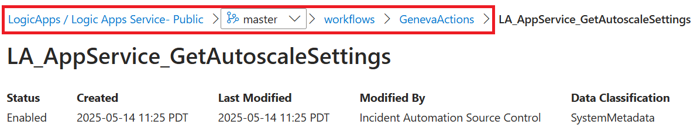
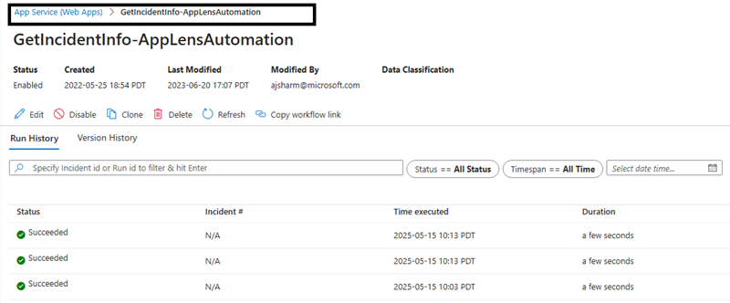
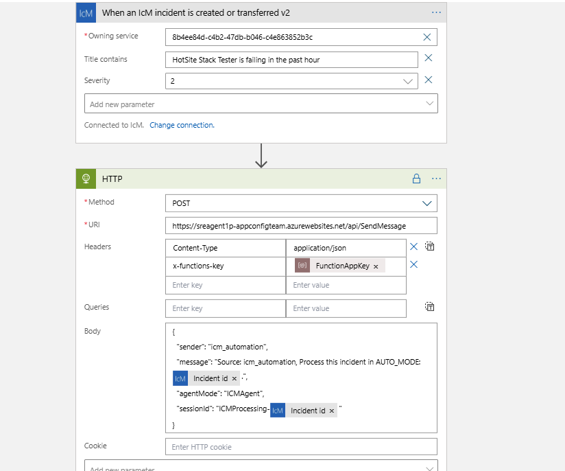
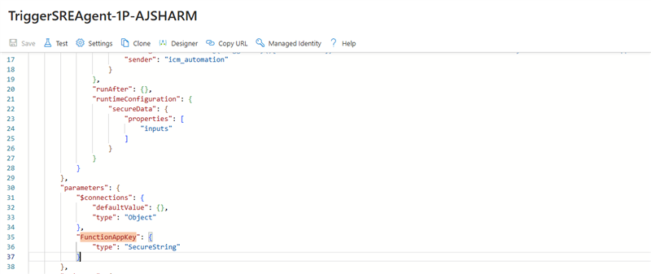
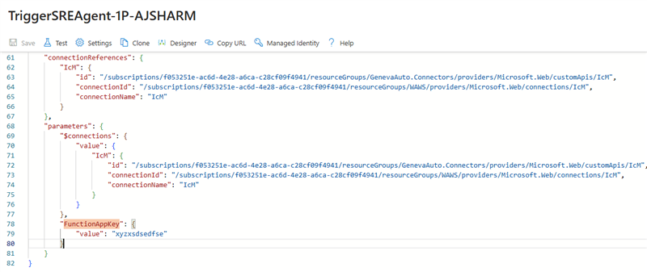
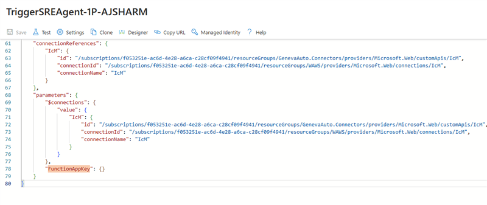

# Setting up the agent to listen to incoming incidents

## Deploy the Agent

Ensure the Agent is deployed and you have the Function App Endpoint and Key.

## Communicate with the deployed Agent

- Agent (Function App) surfaces a controller to trigger the agent. api/SendMessage

Test it out by sending a POST request with the following body:

{
  "sender": "icm_automation",
  "message": "Hi",
  "agentMode": "ICMAgent",
  "sessionId": "12323232342"
}


## How to Trigger the Agent from ICM Automation/Geneva Automation

- To trigger it on incoming Incidents, create an ICM Workflow which listens to incident events and triggers the function app endoint with a body like:

{
  "sender": "icm_automation",
  "message": "A new Incident <Incident ID> has been created.",
  "agentMode": "ICMAgent",
  "sessionId": "ICMProcessing-<Incident ID>"
}


- To authenticate to the Function App from ICM Workflow:

  - Path 1: Using Function Key
    - You can use the Function App Key as a Secure String parameter (**DO NOT do this if your ICM Workflows have Source Control enabled**) (https://eng.ms/docs/products/icm/automation/tutorials/securinghttpconnectorsecrets)
    - Or you can store the function app key in Azure Key Vault and fetch from there in ICM Workflow (https://eng.ms/docs/products/icm/automation/sourcecontrol/secretsinsourcecontrol)
  
  - Path 2: Using Managed Identity Authentication
    - Enable Managed Identity Authentication in your ICM Workflow (using the UAMI created above).
      https://eng.ms/docs/products/icm/developers/accesswithmsiauth
    - For this you will also have to setup the App Service Authentication on the Production Function App (aka EasyAuth) and allow the UAMI to access the function app in azure portal
      https://learn.microsoft.com/en-us/azure/app-service/scenario-secure-app-authentication-app-service?tabs=workforce-configuration
    - Once EasyAuth is enabled in your deployed FunctionApp resource, you will also disable any Function Level Auth on the SendMessage function in ApiController and set it to Anonymous Auth to ensure Function App Key is not needed and the only thing needed is the bearer token of the Managed Identity.


## Creating an ICM Workflow to Trigger the SRE Agent

This document provides step-by-step instructions on how to create an ICM Workflow that triggers the SRE Agent. Follow these steps to set up the workflow in your tenant.

### Prerequisites
Workflow Author Permission: Ensure you have Workflow Author permission in your ICM Workflows.
Source Control Check: Verify if Source Control is enabled or not. **If source control is enabled, you cannot use SecureString path with FunctionAppKey.**

Source Control Enabled:  


Source Control Disabled:  


### Step-by-Step Instructions
1. Create a Simple ICM Workflow

You will create a simple ICM workflow in your tenant to call the agent on new incoming incidents. 

Here is an example workflow:



2. Set SecureString Parameter

You will need to set the FunctionAppKey as a SecureString parameter. Follow these steps:

Register the Variable as a Secure String:  
Go to code editor mode and in your parameters section, register the variable as a secure string:  


Provide the Value of the Variable:  
In the parameters section at the bottom, provide the value of that variable:  


Save the Workflow:  
Once saved, the ICM automation will hide the value and display it as empty, but that's okay:  


### Example Code Snippet

Here is an example of how you can define the FunctionAppKey as a SecureString in your workflow JSON:

```json
{
    "definition": {
        "$schema": "https://schema.management.azure.com/providers/Microsoft.Logic/schemas/2016-06-01/workflowdefinition.json#",
        "actions": {
            "HTTP": {
                "type": "Http",
                "inputs": {
                    "method": "POST",
                    "uri": "https://sreagent1p-<AGENT_NAME>.azurewebsites.net/api/SendMessage",
                    "headers": {
                        "Content-Type": "application/json",
                        "x-functions-key": "@parameters('FunctionAppKey')"
                    },
                    "body": {
                        "sender": "icm_automation",
                        "message": "Source: icm_automation, Process this incident in AUTO_MODE: @{triggerBody()['IncidentId']}",
                        "agentMode": "ICMAgent",
                        "sessionId": "ICMProcessing-@{triggerBody()['IncidentId']}"
                    }
                },
                "runAfter": {},
                "runtimeConfiguration": {
                    "secureData": {
                        "properties": [
                            "inputs"
                        ]
                    }
                }
            }
        },
        "parameters": {
            "$connections": {
                "defaultValue": {},
                "type": "Object"
            },
            "FunctionAppKey": {
                "type": "SecureString"
            }
        },
        "triggers": {
            "When_an_IcM_incident_is_created_or_transferred_v2": {
                "type": "ApiConnectionWebhook",
                "inputs": {
                    "host": {
                        "connection": {
                            "name": "@parameters('$connections')['IcM']['connectionId']"
                        }
                    },
                    "body": {
                        "OwningServicePublicId": "YOUR_TEAM_PUBLIC_ID",
                        "Title": "KEYWORDS TO FILTER ON TITLE",
                        "WorkflowCallbackUrl": "@{listCallbackUrl()}",
                        "Severity": "2"
                    },
                    "path": "/api/v2/subscriptions/createdOrTransferred"
                }
            }
        },
        "contentVersion": "1.0.0.0",
        "description": "Trigger for AppConfig Triager Agent"
    },
    "connectionReferences": {
        "IcM": {
            "id": "/subscriptions/********-****-****-****-************/resourceGroups/GenevaAuto.Connectors/providers/Microsoft.Web/customApis/IcM",
            "connectionId": "/subscriptions/********-****-****-****-************/resourceGroups/WAWS/providers/Microsoft.Web/connections/IcM",
            "connectionName": "IcM"
        }
    },
    "parameters": {
        "$connections": {
            "value": {
                "IcM": {
                    "id": "/subscriptions/********-****-****-****-************/resourceGroups/GenevaAuto.Connectors/providers/Microsoft.Web/customApis/IcM",
                    "connectionId": "/subscriptions/********-****-****-****-************/resourceGroups/WAWS/providers/Microsoft.Web/connections/IcM",
                    "connectionName": "IcM"
                }
            }
        },
        "FunctionAppKey": {}
    }
}
```

### Final Notes:
- Ensure that you have the necessary permissions and source control settings before starting.
- If you need assistance with setting the FunctionAppKey as a SecureString parameter, please reach out for help.
