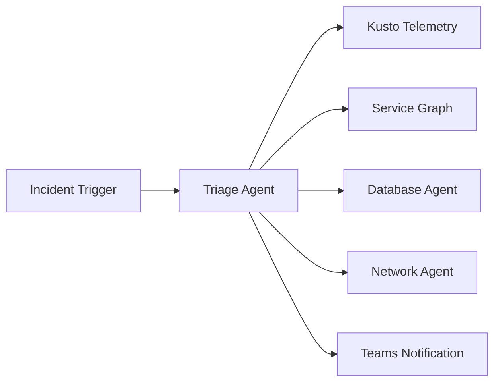

# SRE Agent MCP Server Architecture & Workflow Guide

## Problem Statement

**Target Audience**: Developers building SRE agent workflows with an inner-loop development experience in VS Code.

**Core Challenge**: Building SRE agents requires configuring multiple interconnected YAML files (agents, tools, triggers, scheduled tasks) with proper system prompts optimized for GPT-4/5. Developers need:

1. **Guidance** on how to structure agents for their use case
2. **Prompt engineering** help for writing effective system prompts
3. **Configuration scaffolding** to generate proper YAML files
4. **Validation** to catch issues before deployment
5. **E2E workflow design** to understand how all pieces connect

## Architecture Overview

```
┌─────────────────────────────────────────────────────────────────────────────┐
│                              VS Code + Copilot                               │
│  ┌─────────────────────────────────────────────────────────────────────────┐│
│  │                         GitHub Copilot Agent                            ││
│  │   "Help me build an SRE agent for incident triage"                      ││
│  └───────────────────────────────┬─────────────────────────────────────────┘│
│                                  │ MCP Protocol (stdio)                      │
│                                  ▼                                           │
│  ┌─────────────────────────────────────────────────────────────────────────┐│
│  │                      srectl mcp-server                                  ││
│  │                                                                          ││
│  │  ┌──────────────┐  ┌──────────────┐  ┌──────────────┐  ┌──────────────┐ ││
│  │  │  Discovery   │  │   Design     │  │  Configure   │  │   Validate   │ ││
│  │  │    Tools     │  │    Tools     │  │    Tools     │  │    Tools     │ ││
│  │  ├──────────────┤  ├──────────────┤  ├──────────────┤  ├──────────────┤ ││
│  │  │list_agents   │  │design_e2e_   │  │start_agent_  │  │validate_     │ ││
│  │  │list_tools    │  │  workflow    │  │  build       │  │  workflow    │ ││
│  │  │get_config_   │  │analyze_      │  │configure_    │  │get_workspace │ ││
│  │  │  options     │  │  prompt      │  │  agent       │  │  _files      │ ││
│  │  │explain_      │  │get_prompt_   │  │add_tool      │  │              │ ││
│  │  │  concept     │  │  template    │  │set_trigger   │  │              │ ││
│  │  └──────────────┘  └──────────────┘  └──────────────┘  └──────────────┘ ││
│  │                                                                          ││
│  │  ┌─────────────────────────────────────────────────────────────────────┐││
│  │  │                     In-Memory Build Context                         │││
│  │  │  - Agent configurations being built                                 │││
│  │  │  - Session history and decisions                                    │││
│  │  │  - Persisted to ~/.srectl/mcp-memory.json                          │││
│  │  └─────────────────────────────────────────────────────────────────────┘││
│  └─────────────────────────────────────────────────────────────────────────┘│
└─────────────────────────────────────────────────────────────────────────────┘
                                  │
                                  ▼ Generated YAML files
┌─────────────────────────────────────────────────────────────────────────────┐
│                         Your Workspace                                       │
│                                                                              │
│  agents/                    tools/                    scheduledtasks/        │
│  └── my-agent/              └── my-tools.yaml         └── my-task.yaml      │
│      ├── my-agent.yaml                                                       │
│      └── README.md          connectors/               incidenthandlers/      │
│                             └── kusto.yaml            └── my-handler.yaml   │
└─────────────────────────────────────────────────────────────────────────────┘
                                  │
                                  ▼ srectl apply
┌─────────────────────────────────────────────────────────────────────────────┐
│                         SRE Agent Platform                                   │
│                                                                              │
│  ┌─────────────┐    ┌─────────────┐    ┌─────────────┐    ┌─────────────┐  │
│  │   Agents    │    │    Tools    │    │  Triggers   │    │ Connectors  │  │
│  └─────────────┘    └─────────────┘    └─────────────┘    └─────────────┘  │
└─────────────────────────────────────────────────────────────────────────────┘
```

## VS Code Configuration

### Step 1: Install the MCP Server

The `srectl` CLI includes a built-in MCP server. First, ensure you have it installed:

```bash
# Install srectl as a global .NET tool
dotnet tool install -g srectl

# Verify installation
srectl --version
```

### Step 2: Configure VS Code MCP Settings

Add to your VS Code `settings.json` (Ctrl+Shift+P → "Preferences: Open User Settings (JSON)"):

```json
{
  "github.copilot.chat.mcpServers": {
    "sreagent": {
      "command": "srectl",
      "args": ["mcp", "stdio"]
    }
  }
}
```

### Step 3: Verify Connection

1. Open VS Code
2. Open Copilot Chat (Ctrl+Shift+I)
3. Ask: "What SRE agents exist in my workspace?"
4. Copilot should use the MCP server to list agents

## Recommended Workflow

### Phase 1: Design (Architecture First!)

**Always start by designing the architecture.** Ask Copilot:

```
"I need to build an SRE agent for [your use case].
Help me design the end-to-end workflow including:
- What triggers should invoke it
- What data sources it needs
- What actions it should take
- How it should report results"
```

The MCP will call `design_e2e_workflow` which returns:
- A Mermaid architecture diagram
- Step-by-step implementation plan
- Required YAML configurations
- Validation checklist

**Example Design Output:**



### Phase 2: Prompt Engineering

Get an optimized system prompt template:

```
"Give me a prompt template for incident triage"
```

The MCP calls `get_prompt_template` → returns a battle-tested template with:
- Placeholder variables
- Best practices
- Usage examples

If you have an existing prompt, validate it:

```
"Analyze this system prompt for my triage agent: [your prompt]"
```

The MCP calls `analyze_prompt` → returns:
- Strengths and weaknesses
- Specific improvement suggestions
- An improved version of your prompt

### Phase 3: Configuration

Start building your agent configuration:

```
"Start building an agent called 'incident-triage' for triaging database incidents"
```

The MCP calls `start_agent_build` → creates an in-memory context

Add tools:

```
"Add a Kusto tool to query error logs"
```

The MCP calls `add_tool` → updates the context

Set up trigger:

```
"Configure this to trigger on P1 and P2 incidents for the SQL service"
```

The MCP calls `set_trigger` → updates the context

### Phase 4: Generate & Validate

Generate all workspace files:

```
"Generate the YAML files for my incident-triage agent"
```

The MCP calls `generate_workspace_files` → creates:
- `agents/incident-triage/incident-triage.yaml`
- `agents/incident-triage/README.md`
- `tests/incident-triage-tests.yaml`

Validate the configuration:

```
"Validate my incident-triage agent configuration"
```

The MCP calls `validate_workflow` → returns:
- ✓ Pass/fail for each component
- Warnings about potential issues
- Recommendations

### Phase 5: Deploy & Test

Use `srectl` CLI commands (shown in MCP output):

```bash
# Apply the configuration
srectl agent apply --name incident-triage

# Test with a sample message
srectl agent test --name incident-triage --message "Database connection timeouts in prod"

# Watch logs
srectl agent logs --name incident-triage --follow
```

## MCP Tools Reference

### Discovery Tools

| Tool | Purpose | When to Use |
|------|---------|-------------|
| `list_agents` | List all agents in workspace | Starting a session, checking what exists |
| `list_tools` | List available tools | Deciding what tools to add to an agent |
| `get_config_options` | Get all options for a config type | Understanding what fields are available |
| `explain_concept` | Explain SRE Agent concepts | Learning about agents, tools, triggers, etc. |

### Design Tools

| Tool | Purpose | When to Use |
|------|---------|-------------|
| `design_e2e_workflow` | Design complete workflow with diagram | **ALWAYS START HERE** - before any configuration |
| `analyze_prompt` | Analyze and improve system prompts | When writing or improving prompts |
| `get_prompt_template` | Get battle-tested prompt templates | Starting a new agent type |
| `get_prompt_patterns` | Get prompt engineering patterns | Optimizing prompts for GPT-4/5 |
| `generate_test_scenarios` | Generate test cases for prompts | Before deploying a new agent |

### Configuration Tools

| Tool | Purpose | When to Use |
|------|---------|-------------|
| `start_agent_build` | Start building a new agent | Beginning agent configuration |
| `configure_agent` | Set agent properties | Configuring system prompt, type, etc. |
| `add_tool` | Add a tool to the agent | Giving agent capabilities |
| `set_trigger` | Configure how agent is triggered | Setting up incident handlers, schedules |
| `add_handoff` | Configure agent handoffs | Building orchestrator agents |
| `get_current_config` | View current build state | Checking progress |

### Validation & Output Tools

| Tool | Purpose | When to Use |
|------|---------|-------------|
| `validate_workflow` | Validate entire configuration | Before deploying |
| `generate_workspace_files` | Generate YAML files | Ready to create files |
| `get_workspace_files` | Preview files without creating | Reviewing before creation |

## Key Principles

### 1. Agents are YAML, Not Code

SRE Agents are configured entirely through YAML files. You do NOT write C# code for agents.

**What YAML defines:**
- Agent name and system prompt
- Tools the agent can use (references to existing tools)
- Handoffs to other agents
- Trigger configuration

**Example Agent YAML:**

```yaml
api_version: azuresre.ai/v1
kind: AgentConfiguration
metadata:
  owner: your-team@company.com
  version: '1.0.0'
spec:
  name: incident-triage
  system_prompt: |
    You are an Incident Triage Agent. Your job is to:
    1. Assess incoming incidents quickly
    2. Gather initial context using your tools
    3. Route to the appropriate specialist

    Available specialists:
    - DatabaseAgent: Database issues
    - NetworkAgent: Connectivity issues

  agent_type: Orchestrator
  tools:
    - QueryRecentAlerts
    - GetServiceHealth
    - CheckRecentDeployments
  handoffs:
    - DatabaseAgent
    - NetworkAgent
  temperature: 0.3
```

### 2. Tools are Defined Separately

Tools can be:
- **Built-in tools** - Provided by the platform (Kusto, Azure Monitor, etc.)
- **Custom tools** - Defined in YAML with KQL queries or Python code

**Example Kusto Tool YAML:**

```yaml
api_version: azuresre.ai/v1
kind: Tool
spec:
  name: QueryRecentAlerts
  type: KustoTool
  connector: kusto-telemetry
  description: Query recent alerts from the alerting system
  mode: Query
  database: AlertsDB
  query: |
    Alerts
    | where Timestamp > ago({{hours}}h)
    | where Severity in ({{severities}})
    | project Timestamp, AlertName, Severity, Description
    | order by Timestamp desc
    | take 100
  parameters:
    - name: hours
      type: int
      default: 1
      description: How many hours back to query
    - name: severities
      type: array
      default: ["Sev1", "Sev2"]
      description: Severity levels to include
```

### 3. Design First, Configure Second

Always use `design_e2e_workflow` before starting configuration. This ensures you:
- Understand all the pieces needed
- Have an architecture diagram to reference
- Know the implementation order
- Have a validation checklist

## Minimum Viable Workflow Commands

For the fastest path to a working agent, here's the minimum sequence:

```
1. "Design a workflow for [your goal]"
   → MCP: design_e2e_workflow
   → Output: Architecture diagram, steps, checklist

2. "Get a prompt template for [agent type]"
   → MCP: get_prompt_template
   → Output: System prompt template

3. "Start building agent called [name]"
   → MCP: start_agent_build
   → Output: Build context created

4. "Configure the system prompt: [your prompt]"
   → MCP: configure_agent
   → Output: Prompt set

5. "Add tool [tool-name]"
   → MCP: add_tool (repeat for each tool)
   → Output: Tool added

6. "Generate the files"
   → MCP: generate_workspace_files
   → Output: YAML files created

7. "Validate the configuration"
   → MCP: validate_workflow
   → Output: Validation results
```

**CLI commands to deploy:**

```bash
srectl agent apply --name [name]
srectl agent test --name [name] --message "test"
```

## Troubleshooting

### MCP Server Not Connecting

1. Verify srectl is installed: `srectl --version`
2. Test MCP server manually: `srectl mcp-server` (should wait for input)
3. Check VS Code settings.json syntax
4. Restart VS Code

### Tools Not Listed

1. Check connector configuration in workspace
2. Verify `.sreagent` directory exists
3. Run `srectl tool list` to see available tools

### Agent Validation Fails

1. Check all referenced tools exist
2. Verify connector names match
3. Ensure system prompt is not empty
4. Check YAML syntax with `srectl agent validate --name [name]`
