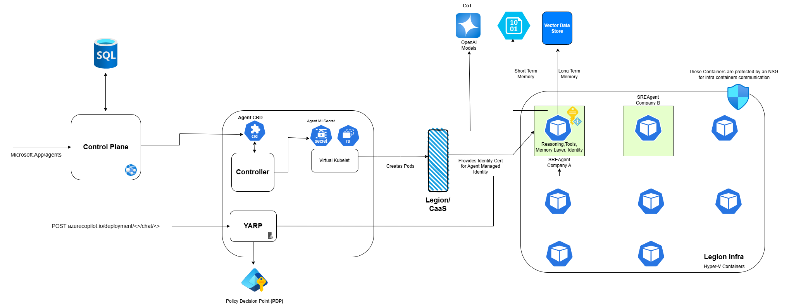

# Architecture Overview

## Component Architecture
The SRE Agent consists of three main components:

1. **Discovery**
   - Handles permission management
   - Utilizes discovery tools

2. **Reasoning (Proactive)**
   - Leverages Knowledge Graph
   - Implements Best Practices Chain of Thought
   - Uses specialized tools

3. **Actions**
   - Interfaces with Knowledge Graph
   - Implements Remediation Chain of Thought
   - Executes through specialized tools

## Infrastructure Architecture

[Back to README](../README.md) 