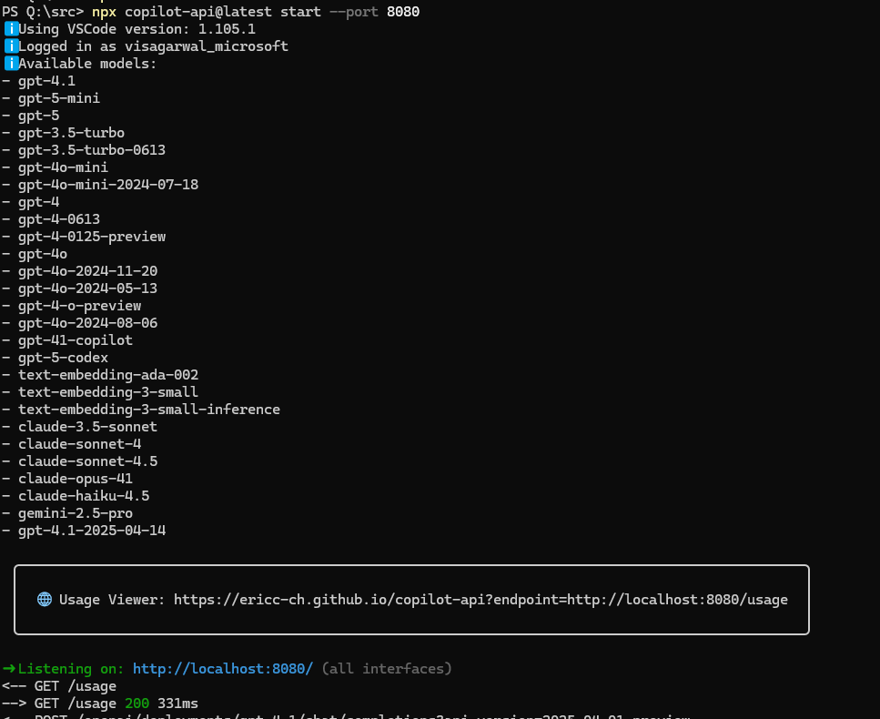
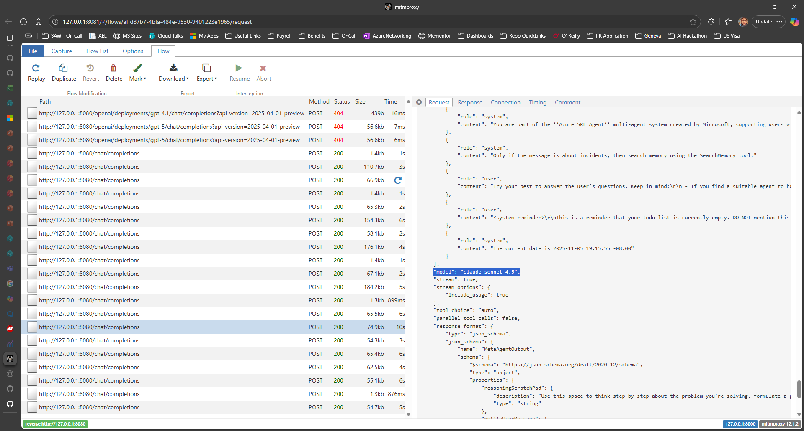

# GitHub Copilot API Setup Guide

This guide explains how to configure the SRE Agent Runtime to use GitHub Copilot's API as the LLM backend.

## Overview

The GitHub Copilot API provides access to the same language models used by GitHub Copilot in VS Code. You can use this as an alternative to Azure OpenAI for local development and testing.

## Setup Instructions

### Basic Setup

1. **Start the Copilot API Proxy**

   Run the following command in your terminal:

   ```powershell
   npx copilot-api@latest start --port 8080
   ```

2. **Complete Device Login Flow**

   The proxy will prompt you to authenticate with GitHub:
   - Follow the device login flow displayed in the terminal
   - This will fetch the token used to call the GitHub Copilot API (the same backend that VS Code Copilot uses)
   - Complete the authentication in your browser

3. **Configure Application Settings**

   Update your `appsettings.Development.json` file with the following configuration:

   ```json
   "Core": {
    "Azure": {
     "OpenAI": {
       "GhcpEndpoint": "http://localhost:8000", // NEW CONFIG!!
       "LLMDeploymentName": "gpt-5",
       "Endpoint": "https://visheshopenai-resource.openai.azure.com/",
       "ApiKey": "<YourCognitiveServicesApiKey>",
       "EmbeddingGeneratorDeploymentName": "text-embedding-3-large",
       "EmbeddingGeneratorModelName": "text-embedding-3-large"
      }
     }
    }
   ```

4. **Start the Application**

   Run the SRE Agent Runtime as usual. It will now use GitHub Copilot's API for LLM requests.

## Using Anthropic Models

To use Anthropic models (like Claude) through the GitHub Copilot API, you need to configure the model names in your `appsettings.Development.json`:

```json
"Core": {
  "ChatClientProvider": {
    "ModelNames": "gpt-5,gpt-5-mini,gpt-4o,gpt-4.1",
    "DefaultModelName": "claude-sonnet-4.5", // UPDATE!!
    "FastModelName": "gpt-4.1",
    "LargeContextModelName": "gpt-4.1",
    "EmbeddingModelName": "text-embedding-3-large"
  }
}
```

### Available models



## Advanced Setup: Using MITM Proxy

For debugging, monitoring, or inspecting API requests, you can use a Man-In-The-Middle (MITM) proxy.

### Setup with MITM Proxy

1. **Install MITM Proxy** (if not already installed)

   ```powershell
   pip install mitmproxy
   ```
   OR
   ```powershell
   choco install mitmproxy
   ```

2. **Start the Copilot API Proxy**

   ```powershell
   npx copilot-api@latest start --port 8000
   ```

   Note: Using port 8000 instead of 8080.

3. **Start MITM Proxy**

   ```powershell
   mitmweb --mode reverse:http://127.0.0.1:8000 --listen-host 127.0.0.1 --listen-port 8080
   ```

   This configuration:
   - Listens on port 8080 (the port your application will connect to)
   - Forwards requests to the Copilot API proxy on port 8000
   - Opens a web interface at `http://127.0.0.1:8081` for inspecting traffic

4. **Configure Application Settings**

   Use the same configuration as the basic setup:

   ```json
   "Core": {
    "Azure": {
     "OpenAI": {
       "GhcpEndpoint": "http://localhost:8000", // NEW CONFIG!!
       "LLMDeploymentName": "claude-sonnet-4.5",
       "Endpoint": "https://visheshopenai-resource.openai.azure.com/",
       "ApiKey": "<YourCognitiveServicesApiKey>",
       "EmbeddingGeneratorDeploymentName": "text-embedding-3-large",
       "EmbeddingGeneratorModelName": "text-embedding-3-large"
      }
     }
    }
   ```

5. **View Request Details**

   Open `http://127.0.0.1:8081` in your browser to see the MITM web interface where you can:
   - Inspect all HTTP requests and responses
   - View headers, payloads, and response bodies
   - Debug API interactions in real-time

   

## Troubleshooting

### Authentication Issues

- **Token Expired:** If you see authentication errors, restart the `copilot-api` proxy and complete the device login flow again.
- **Copilot Subscription:** Ensure your GitHub account has an active Copilot subscription.

### Connection Issues

- **Port Already in Use:** If port 8080 or 8000 is already in use, choose different ports and update the configuration accordingly.
- **Firewall/Network:** Ensure your firewall allows connections to localhost on the specified ports.

### API Compatibility

- **Model Names:** GitHub Copilot may use different model names or versions. Check the `copilot-api` documentation for the latest supported models.
- **Embeddings:** Ensure the embedding model specified is compatible with your use case.

## Notes

- The GitHub Copilot API is intended for development and testing purposes
- API rate limits may apply based on your Copilot subscription
- The `copilot-api` proxy must remain running while the application is in use
- Authentication tokens are cached locally but may need periodic renewal

## See Also

- [Development Setup](development-setup.md)
- [Running the App](running-the-app.md)
- [Architecture Documentation](architecture.md)
