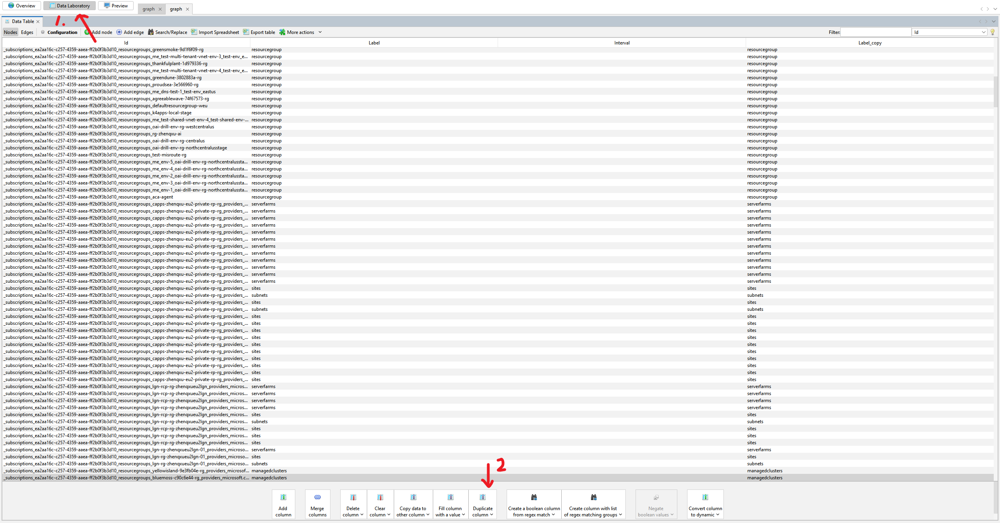
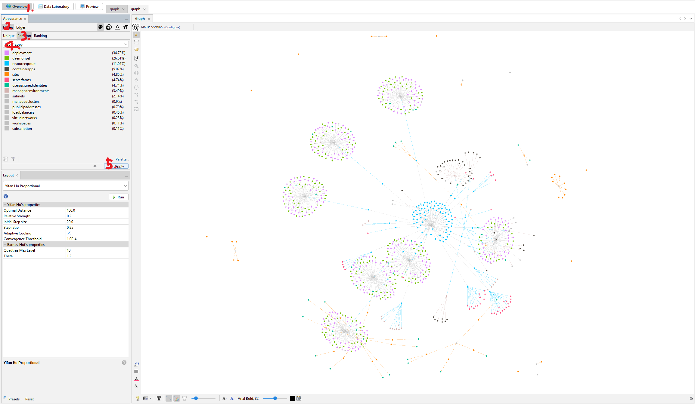

# Graph Visualization Guide

## Prerequisites
- [Gephi](https://gephi.org/)

## Export Graph Data
Run the following command to export your graph data:
```powershell
just agent ExportGraph [Path]
```

## Visualize Using Gephi

### Coloring Vertices by Labels
1. Duplicate the label column:
   

2. Apply colors to the duplicated labels:
   

### Coloring Edges by Labels
Follow the same process as coloring vertices:
1. Duplicate the edge label column
2. Apply colors to the duplicated labels

### Tips
- Use the Preview mode to enable zooming and dragging
- Adjust layout algorithms to better visualize your graph structure
- Save your visualization settings for future use

[Back to Graph Database](graph-database.md) | [Next: Deployment Guide](deployment.md) 
