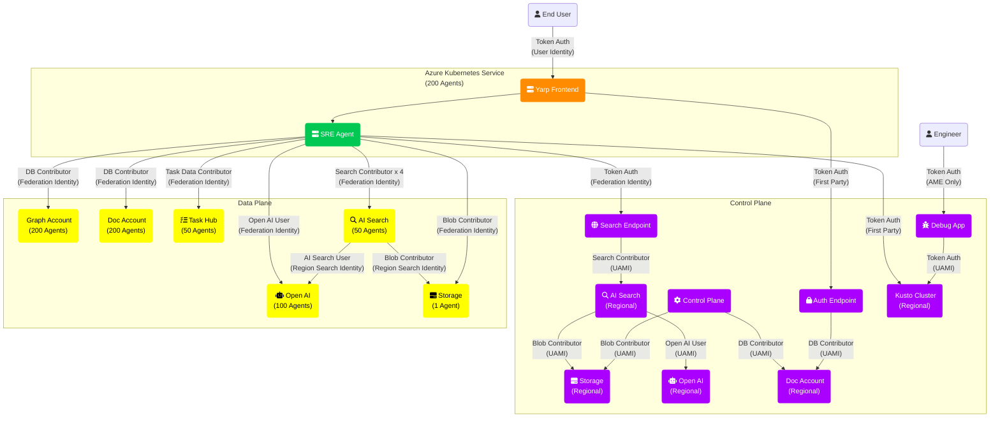

# Architecture Overview

Overall architecture for Control Plane and Data Plane

```mermaid
graph TD

%% Generate from https://mermaid.live/

%% Nodes
    %% Control Plane
    subgraph CP["Control Plane"]
        ControlPlane("fa:fa-cog Control Plane")
        style ControlPlane color:#FFFFFF, fill:#AA00FF, stroke:#AA00FF
        SearchEndpoint("fa:fa-globe Search Endpoint")
        style SearchEndpoint color:#FFFFFF, fill:#AA00FF, stroke:#AA00FF
        RegionalStorage("fa:fa-hdd Storage<br/>(Regional)")
        style RegionalStorage color:#FFFFFF, fill:#AA00FF, stroke:#AA00FF
        RegionalOpenAI("fa:fa-robot Open AI<br/>(Regional)")
        style RegionalOpenAI color:#FFFFFF, fill:#AA00FF, stroke:#AA00FF
        RegionalAISearch("fa:fa-search AI Search<br/>(Regional)")
        style RegionalAISearch color:#FFFFFF, fill:#AA00FF, stroke:#AA00FF
        AuthEndpoint("fa:fa-lock Auth Endpoint")
        style AuthEndpoint color:#FFFFFF, fill:#AA00FF, stroke:#AA00FF
        RegionalDocAccount("fa:fa-Account Doc Account<br/>(Regional)")
        style RegionalDocAccount color:#FFFFFF, fill:#AA00FF, stroke:#AA00
        KustoCluster("fa:fa-Account Kusto Cluster<br/>(Regional)")
        style KustoCluster color:#FFFFFF, fill:#AA00FF, stroke:#AA00
        DebugApp("fa:fa-bug Debug App")
        style DebugApp color:#FFFFFF, fill:#AA00FF, stroke:#AA00FF
    end

    %% SRE Agent and Data Resources

    subgraph AKS["Azure Kubernetes Service<br/>(200 Agents)"]
        Agent("fa:fa-server SRE Agent")
        style Agent color:#FFFFFF, fill:#00C853, stroke:#00C853

        YARP("fa:fa-server Yarp Frontend")        
        style YARP color:#FFFFFF, fill:#FF8C00, stroke:#FF8C00
    end

    subgraph DP["Data Plane"]
        GraphAccount("fa:fa-Account Graph Account<br/>(200 Agents)")
        style GraphAccount color:#000000, fill:#FFFF00, stroke:#FFFF00
        
        DocAccount("fa:fa-Account Doc Account<br/>(200 Agents)")
        style DocAccount color:#000000, fill:#FFFF00, stroke:#FFFF00
        OpenAI("fa:fa-robot Open AI<br/>(100 Agents)")
        style OpenAI color:#000000, fill:#FFFF00, stroke:#FFFF00
        Storage("fa:fa-hdd Storage<br/>(1 Agent)")
        style Storage color:#000000, fill:#FFFF00, stroke:#FFFF00
        TaskHub("fa:fa-tasks Task Hub<br/>(50 Agents)")
        style TaskHub color:#000000, fill:#FFFF00, stroke:#FFFF00
        AISearch("fa:fa-search AI Search<br/>(50 Agents)")
        style AISearch color:#000000, fill:#FFFF00, stroke:#FFFF00
    end

    EndUser("fa:fa-user End User")
    Engineer("fa:fa-user Engineer")

%% Edge connections between nodes
    EndUser -- Token Auth<br/>(User Identity) --> YARP

    Agent -- DB Contributor<br/>(Federation Identity) --> GraphAccount
    Agent -- DB Contributor<br/>(Federation Identity) --> DocAccount
    Agent -- Task Data Contributor<br/>(Federation Identity)  --> TaskHub
    Agent -- Search Contributor x 4<br/>(Federation Identity)  --> AISearch
    Agent -- Open AI User<br/>(Federation Identity) --> OpenAI
    AISearch -- AI Search User</br>(Region Search Identity) --> OpenAI
    AISearch -- Blob Contributor<br/>(Region Search Identity) --> Storage
    Agent -- Blob Contributor<br/>(Federation Identity) --> Storage

    RegionalAISearch -- Blob Contributor<br/>(UAMI) --> RegionalStorage
    RegionalAISearch -- Open AI User<br/>(UAMI) --> RegionalOpenAI

    SearchEndpoint -- Search Contributor<br/>(UAMI) --> RegionalAISearch

    ControlPlane -- DB Contributor<br/>(UAMI) --> RegionalDocAccount
    AuthEndpoint -- DB Contributor<br/>(UAMI) --> RegionalDocAccount
    ControlPlane -- Blob Contributor<br/>(UAMI) --> RegionalStorage
   
    Agent -- Token Auth<br/>(Federation Identity) --> SearchEndpoint
    YARP -- Token Auth<br/>(First Party) --> AuthEndpoint

    YARP --> Agent

    Agent -- Token Auth<br/>(First Party) --> KustoCluster

    DebugApp -- Token Auth<br/>(UAMI) --> KustoCluster
    Engineer -- Token Auth<br/>(AME Only) --> DebugApp
    DebugApp 
```