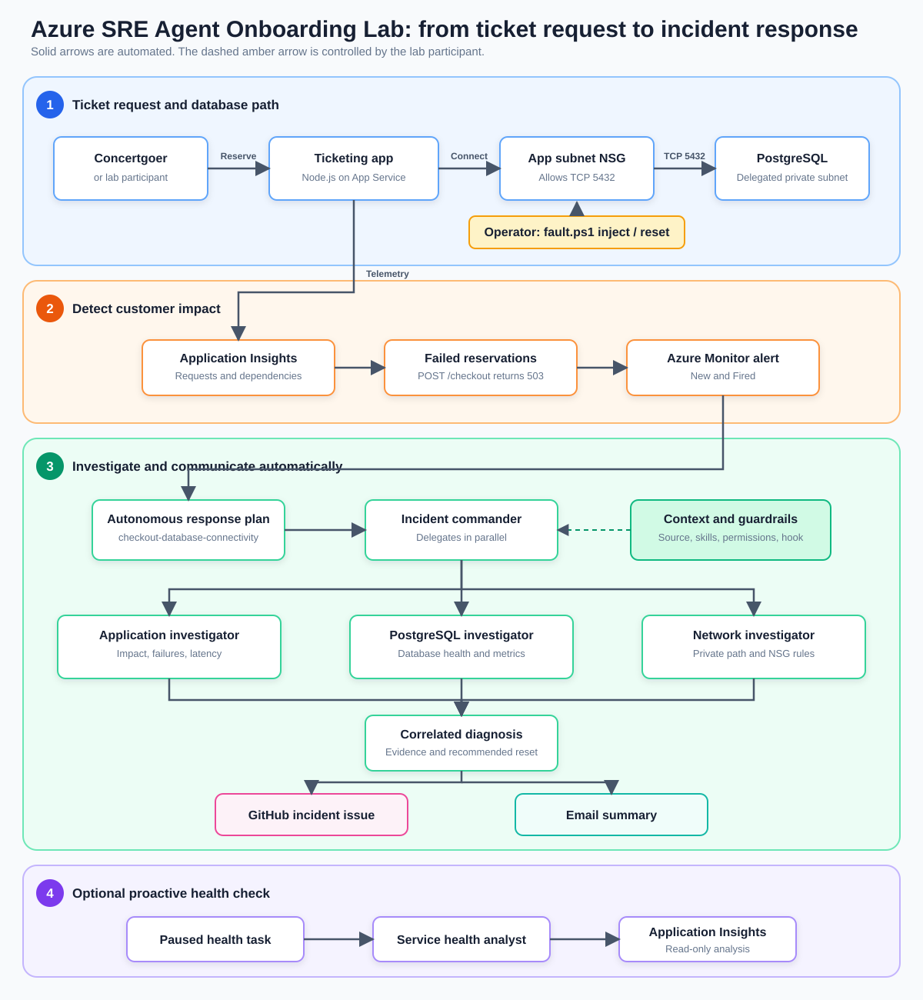

# Azure SRE Agent Onboarding Lab

**Autonomous incident response with Azure SRE Agent**

Deploy a concert ticketing service, introduce a database connectivity failure, and follow an Azure SRE Agent investigation from alert to diagnosis and follow-up.

## Lab at a glance

| Lab profile | Details |
| --- | --- |
| **Workload** | Node.js ticketing API, Azure Database for PostgreSQL, and private networking |
| **Incident** | An NSG rule blocks the application's PostgreSQL connection on TCP 5432 |
| **Agent response** | Read-only investigators correlate application, database, network, and source-code evidence |
| **Operator boundary** | You inject and reset the fault; the agent diagnoses and communicates but does not modify Azure |

> [!IMPORTANT]
> This lab deploys billable Azure resources. Run the [cleanup](#cleanup) step when you finish.

The diagram below shows how requests, telemetry, alerts, investigation, and follow-up actions connect throughout the lab.



[Open the architecture diagram full size](assets/architecture.svg).

## Before you start

**Required tools and access**

- Git, VS Code, Azure CLI, and Azure Developer CLI (`azd`)
- macOS: Bash, `curl`, and `jq` (`brew install jq`)
- Windows: PowerShell 7
- Node.js 22 or later
- An Azure subscription where you can create resources and role assignments
- A GitHub repository for workshop-generated issues
- An email account and approved recipients for incident summaries

**Deployment region**

Use **Sweden Central** for the workshop. The complete lab has been rehearsed there with SRE Agent, Linux App Service B1, and PostgreSQL 16 on `Standard_B1ms`.

<details>
<summary><strong>Region, capacity, and cross-region access details</strong></summary>

Sweden Central is the tested default, not a capacity guarantee. Azure quota, SKU availability, and regional capacity vary by subscription.

SRE Agent can investigate authorized resources in other regions. Managed identity and Azure RBAC scope determine access, not co-location. This lab uses one `AZURE_LOCATION` for the agent and workload, so the selected deployment region must support every resource type and SKU in the template.

If deployment reports a quota, SKU, PostgreSQL version, or capacity error, request quota or choose another region after confirming support for SRE Agent, App Service, PostgreSQL, networking, and monitoring. See [Azure quotas](https://learn.microsoft.com/azure/quotas/quotas-overview).

</details>

## 1. Deploy the ticketing workload

**1. Clone the lab**

macOS:

```bash
git clone https://github.com/microsoft/sre-agent.git
cd sre-agent/labs/field-level-up
```

Windows:

```powershell
git clone https://github.com/microsoft/sre-agent.git
Set-Location .\sre-agent\labs\field-level-up
```

**2. Run the deployment**

The command prompts for an environment name, your subscription, and a region. Choose **Sweden Central**.

```powershell
azd auth login
az login
az provider register --namespace Microsoft.DBforPostgreSQL --wait
azd up
```

**What `azd up` deploys**

| Resource | Role in the lab |
| --- | --- |
| Azure App Service | Hosts the Node.js ticket reservation experience and `POST /checkout` API |
| Azure Database for PostgreSQL | Accepts the application's fixed, read-only connectivity query |
| Virtual network and NSG | Provides the private database path and controlled fault boundary |
| Managed identities and RBAC | Authenticate the application and authorize agent reads |
| Application Insights and Log Analytics | Capture request, dependency, and platform telemetry |

The sample does not store ticket or payment data. Each reservation opens a PostgreSQL connection, runs `SELECT 1`, and closes the connection.

**Checkpoint: confirm a healthy baseline**

Retrieve the application URL:

```powershell
azd env get-value SERVICE_CHECKOUT_ENDPOINT_URL
```

Open the application URL and select **Reserve tickets**.

> [!TIP]
> Continue only when the reservation succeeds and the **Confirmed** count increases. A failed baseline request is a deployment problem, not the lab incident.

## 2. Deploy and connect the agent

**Run**

macOS:

```bash
./scripts/deploy-agent.sh
```

Windows:

```powershell
./scripts/deploy-agent.ps1
```

**What the agent deployment script deploys**

| Component | Purpose |
| --- | --- |
| SRE Agent and action identity | Runs investigations with scoped Azure RBAC |
| Dedicated agent telemetry | Keeps agent operations separate from workload telemetry |
| Application Insights connector | Gives the agent ticketing request and dependency evidence |
| `field-level-up-source` Code Access repository | Attaches the public lab source without credentials |
| Lab knowledge and common prompt | Provides resource bindings and evidence standards |
| Evidence-checklist Stop hook | Checks evidence quality before an investigation completes |
| Permission policy | Allows required reads and follow-ups while denying Azure and workspace mutation |

The application investigator scopes repository searches to `labs/field-level-up`. Source access is read-only and separate from the authenticated GitHub capability used to create incident issues.

**Connect follow-up channels**

Retrieve and open the SRE Agent URL:

```powershell
azd env get-value SRE_AGENT_URL
```

In **Connections**:

1. Connect the GitHub repository where the agent may create incident issues. It may be different from the automatically attached source repository.
2. Add and authenticate an email connector that can send to your approved recipients.

> [!CAUTION]
> Authenticate only through the trusted connection UI. Never place credentials in agent chat or script arguments.

**Checkpoint: verify agent access**

Confirm that:

- `field-level-up-source` appears under **Code Access**
- The GitHub connection can create issues in the intended repository
- The email connection can send to the approved recipients
- Recent ticket reservation telemetry is available

## 3. Install and enable the use cases

**1. Configure the follow-up targets**

macOS:

```bash
github_repository_url='https://github.com/YOUR-ORG/YOUR-LAB-REPO'
email_recipient='you@example.com'
email_connector_name='YOUR-AUTHENTICATED-EMAIL-CONNECTOR'
```

Windows:

```powershell
$GitHubRepositoryUrl = 'https://github.com/YOUR-ORG/YOUR-LAB-REPO'
$EmailRecipients = @('you@example.com')
$EmailConnectorName = 'YOUR-AUTHENTICATED-EMAIL-CONNECTOR'
```

**2. Install without activating incidents**

macOS:

```bash
./scripts/deploy-use-cases.sh \
   --github-repository-url "$github_repository_url" \
   --email-recipient "$email_recipient" \
   --email-connector-name "$email_connector_name"
```

Repeat `--email-recipient` for each additional approved recipient.

Windows:

```powershell
./scripts/deploy-use-cases.ps1 -GitHubRepositoryUrl $GitHubRepositoryUrl -EmailRecipients $EmailRecipients -EmailConnectorName $EmailConnectorName
```

**What the use-case deployment script deploys**

| Type | Installed component | Purpose |
| --- | --- | --- |
| Skill | `azure-monitor-rca` | Guides evidence-based Azure investigations |
| Skill | `github-issue-followup` | Creates or reuses one incident issue |
| Skill | `email-incident-followup` | Sends one incident summary |
| Subagent | `database-incident-commander` | Coordinates the incident and follow-ups |
| Subagent | `application-investigator` | Measures reservation failures and dependency impact |
| Subagent | `postgresql-investigator` | Checks PostgreSQL health and availability |
| Subagent | `network-investigator` | Traces the private network path and NSG rules |
| Subagent | `service-health-analyst` | Produces proactive health findings |
| Response plan | `checkout-database-connectivity` | Routes matching alerts to the commander in Autonomous mode |
| Scheduled task | `checkout-daily-health-report` | Runs the health analyst; installed Paused |

The first run installs the alert and response plan in a disabled state, giving you time to verify every connection before autonomous incident handling begins.

**Checkpoint: verify the use cases**

In the SRE Agent UI, confirm that:

- The three skills and five subagents in the table are present
- `checkout-database-connectivity` targets `database-incident-commander`

**3. Enable autonomous incident handling**

macOS:

```bash
./scripts/deploy-use-cases.sh \
   --github-repository-url "$github_repository_url" \
   --email-recipient "$email_recipient" \
   --email-connector-name "$email_connector_name" \
   --enable-incidents \
   --confirm-connections-ready
```

Windows:

```powershell
./scripts/deploy-use-cases.ps1 -GitHubRepositoryUrl $GitHubRepositoryUrl -EmailRecipients $EmailRecipients -EmailConnectorName $EmailConnectorName -EnableIncidents -ConfirmConnectionsReady
```

> [!IMPORTANT]
> Run the enabling command only after every checkpoint above passes. It activates both alerting and autonomous response-plan routing.

## Architecture and responsibilities

| You operate | SRE Agent operates |
| --- | --- |
| Generate reservation demand | Detect and investigate the incident |
| Inject and reset the controlled NSG fault | Run application, PostgreSQL, network, and source-code checks |
| Decide and execute recovery | Correlate evidence and recommend the reset |
| Verify service recovery | Create the configured GitHub issue and email summary |

The action identity uses Azure RBAC for resource and telemetry access. The agent permission policy separately prevents Azure writes, shell execution, and workspace mutation.

## Scenario 1: Investigate a reservation outage

**Trigger the incident**

1. Inject the database network fault:

   macOS:

   ```bash
   ./scripts/fault.sh inject
   ```

   Windows:

   ```powershell
   ./scripts/fault.ps1 inject
   ```

2. In the ticketing application, select **Launch on-sale simulation**.
3. Confirm that reservations fail while the service health check remains available.

**Observe the autonomous response**

Allow time for telemetry ingestion, the five-minute alert evaluation, and the next agent scan. Then:

1. Open the incident thread.
2. Review the application, PostgreSQL, network, and source-code evidence.
3. Confirm that the diagnosis identifies the TCP 5432 NSG deny rule.
4. Confirm that one GitHub issue and one email summary were created.

The response plan routes the alert to `database-incident-commander`. The commander runs three specialist investigators in parallel, correlates their evidence, and recommends the reset. Actions already permitted by the lab policy do not require approval.

**Recover and verify**

1. Restore connectivity:

   macOS:

   ```bash
   ./scripts/fault.sh reset
   ```

   Windows:

   ```powershell
   ./scripts/fault.ps1 reset
   ```

2. Return to the application and confirm that new reservations succeed.

**Expected result**

- The incident thread identifies the blocked app-to-database path
- The thread contains results from all three investigators
- One correlated GitHub issue and one email are produced
- After your reset, ticket reservations succeed again

## Scenario 2: Run a proactive health check

This optional scenario assesses the same service without introducing a fault.

**Run the task**

1. Open **Automation** in the agent UI.
2. Select `checkout-daily-health-report`.
3. Select **Run task now**. Leave its recurring schedule **Paused**.
4. Review the result in the task thread.

**Agent behavior**

`service-health-analyst` reviews the latest availability, failures, and latency. It compares with prior data only when enough history exists and reports missing history explicitly.

**Expected result**

The task thread contains findings, evidence, risks, and recommended follow-up. It does not change resources, create issues, send email, update memory, or publish a Live Report.

## Troubleshooting

| Problem | What to do |
| --- | --- |
| `azd` login has expired | Run `azd auth logout`, then `azd auth login` and retry. |
| Deployment reports unavailable quota, capacity, SKU, or PostgreSQL version | Sweden Central is not guaranteed for every subscription. Review the deployment error and subscription quota. Request quota or choose another region that supports all resources in the template, then remove the partial resource group before retrying. |
| App reservation fails before fault injection | Stop and fix the baseline deployment first. |
| Fault injection says an alert is still firing | Reset the fault, generate successful reservations, and wait for the alert to resolve. |
| Alert fires but no incident appears | Check that its state is **New** and condition is **Fired**, then allow for the next agent scan. |
| GitHub issue or email is missing | Verify the connection supports the required write and inspect the incident thread for its receipt or error. Do not blindly retry an unknown write outcome. |

## Cleanup

Stop the on-sale simulation, then delete the lab resources:

```powershell
azd down
```

Confirm deletion of the lab resource group. GitHub issues and sent email are external artifacts and are not removed by `azd down`.