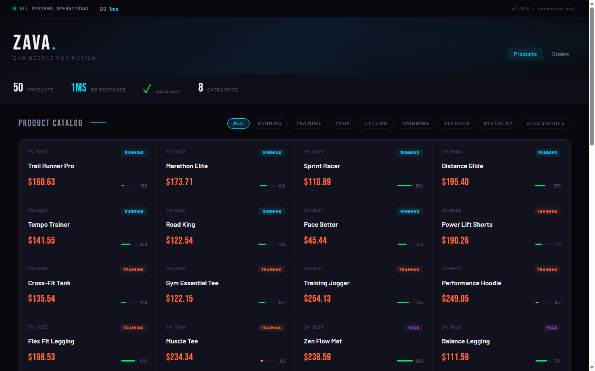
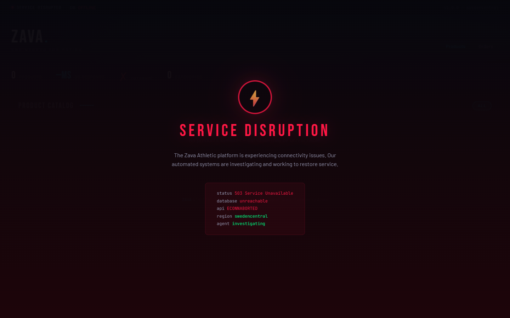

# SRE Agent Demo — Zava Athletic

An AI-first demo showing Azure SRE Agent autonomously detecting and fixing infrastructure issues. Clone it, ask your AI assistant to set it up, break stuff, watch the agent fix it.

## AI-First Setup

This repo is designed to be deployed by an AI agent (Copilot CLI, VS Code Copilot, Claude, etc.). Clone it and ask:

> "Set up this demo for me"

The agent reads `AGENTS.md` and the skills in `.github/skills/` to handle everything — `azd up`, SRE Agent configuration, browser verification. No manual command typing.

Or do it yourself:
```bash
azd up                       # Deploy everything (~25 min)
azd down --force --purge     # Tear down when done
```

Deployment requires **Owner**, **User Access Administrator**, or equivalent
`Microsoft.Authorization/roleAssignments/write` permission at subscription scope.
The correlation skill reads subscription-wide alert and Service Health context,
so the template grants its runtime identity the built-in Reader role there. The
`predown` hook removes that assignment before deleting the resource group.

## What You Get

| Component | Details |
|-----------|---------|
| **App** | Zava Athletic e-commerce storefront (Node.js/Express on AKS) |
| **Database** | PostgreSQL 16 Flexible Server (Entra-only auth, zero passwords) |
| **Monitoring** | App Insights, Log Analytics, OpenTelemetry application metrics, PostgreSQL platform metrics, and three dispatching Azure Monitor alerts: database availability, query performance, and application 5xx failures |
| **SRE Agent** | Preview-channel agent with ARM-deployed core infrastructure and connectors, plus script-applied skills, response plans, knowledge, and global instructions. The source repository is deliberately not connected in this lab. |
| **Telemetry access** | App Insights, Log Analytics, and Azure Monitor exposed via **connectors** |
| **Demo Scenarios** | 5 break/fix scenarios with scripts |

## Architecture

```
Azure Resource Group (single RG — `azd down` cleans everything)

HUB VNet  10.10.0.0/22   (shared edge / security)
  ├─ Azure Firewall — the agent's single egress point AND the "network device"
  │    it interrogates: read its policy/rules over ARM, query AZFW* logs via KQL
  ├─ GatewaySubnet      (reserved → ExpressRoute / VPN gateway to on-prem)
  └─ Private Endpoint → Azure Monitor Private Link Scope (AMPLS)
        ▲                                         ▲
        │ peering                                 │ peering + UDR (forced tunnel)
        │                                         │
  PLATFORM spoke  10.20.0.0/16            AGENT spoke  10.30.0.0/24
    ├─ AKS (private API server)             └─ SRE Agent (VNet-injected, /27 subnet)
    │    ├─ zava-storefront                      • built-in Kubernetes tools + ARM
    │    └─ zava-api  ──►  PostgreSQL 16           (in-pod run-sql.js helper)
    └─ db-subnet (delegated)   (Entra auth)      • all egress → hub firewall only

App Insights + Log Analytics   (AppRequests, AppMetrics, AZFW* firewall logs, KubeEvents …)
```

## What it looks like

The storefront is a normal e-commerce app — when the backend breaks, the UI degrades visibly so the audience can see the failure without reading logs.

| Healthy | Broken (Scenario 1 — PostgreSQL stopped) |
|---|---|
|  |  |
| `ALL SYSTEMS OPERATIONAL` · 50 products · ~1 ms DB response | `SERVICE DISRUPTION` · 503 · `database unreachable` · `agent investigating` |

The storefront's `agent investigating` text is a static failure-state label, not live
agent status. Open the SRE Agent portal to confirm alert dispatch, investigation
progress, and any remediation or approval request.

## Demo Scenarios

### Scenario 1: Database Outage
```powershell
.\.github\skills\running-demo\scripts\break-sql.ps1    # Stops PostgreSQL → 503 errors
# Agent detects via Azure Monitor, investigates, restarts PostgreSQL
.\.github\skills\running-demo\scripts\fix-sql.ps1      # Manual cleanup
```

### Scenario 2: Network Partition
```powershell
.\.github\skills\running-demo\scripts\break-network.ps1  # K8s NetworkPolicy blocks DB traffic
# Agent sees ETIMEDOUT (not ECONNREFUSED), finds and removes NetworkPolicy
.\.github\skills\running-demo\scripts\fix-network.ps1    # Manual cleanup
```

### Scenario 3: Missing Index
```powershell
.\.github\skills\running-demo\scripts\break-db-perf.ps1  # Drops category/name index → slow queries
# The agent uses request, dependency, and PostgreSQL metrics to identify and restore the index.
.\.github\skills\running-demo\scripts\fix-db-perf.ps1    # Manual cleanup
```

### Scenario 4: Bad Deploy / Rollback
```powershell
.\.github\skills\running-demo\scripts\break-bad-deploy.ps1  # kubectl set env FAULT_INJECT=500 → new rollout, GET /api/products returns 500
# The agent compares the 5xx onset with rollout history and restores the previous revision.
.\.github\skills\running-demo\scripts\fix-bad-deploy.ps1    # Manual cleanup: kubectl rollout undo
```
Liveness, readiness, and `/api/health` remain healthy because only the product route is affected.

### Scenario 5: Compound Incident Correlation (Proof of Concept)
```powershell
.\.github\skills\running-demo\scripts\break-compound.ps1  # Scenario 3 + Scenario 4, offset by 90s
# Two independent alerts fire in separate investigation threads.
.\.github\skills\running-demo\scripts\fix-compound.ps1    # Manual cleanup: undoes both
```
This lab-only scenario demonstrates an evidence-based correlation pattern: compare
nearby alerts, establish onset from telemetry, and confirm a shared mechanism before
assigning a common cause. In this case, the slow PostgreSQL queries remain successful
while the HTTP 500 failures are local to the application rollout, so the investigations
should remain independent.

This is a bounded proof of concept, not a comprehensive correlation benchmark.
Results depend on the deployed configuration, available telemetry, and model behavior.
Broader correlation patterns and product-level orchestration require additional
implementation beyond this sample.

### Production context and this lab

For production investigations, give SRE Agent the strongest available context:

- maintainable source code and recent change history through a connected GitHub or
  Azure DevOps repository;
- actionable logs, metrics, traces, deployments, and alerts with consistent resource
  and service identity;
- incident-platform and Azure resource access scoped to the investigation and
  permitted remediation;
- curated response plans, skills, runbooks, and architecture knowledge that reflect
  how the service is actually operated;
- concise global instructions for durable behavior changes, with detailed procedures
  kept in targeted skills.

That setup lets the agent correlate alerts with telemetry and deployments, then connect
production symptoms to specific code and code changes. Microsoft Learn describes these
inputs as complementary: [Azure Monitor alerts](https://learn.microsoft.com/azure/sre-agent/azure-monitor-alerts)
provide the incident signal and connected operational data, while
[connected source code](https://learn.microsoft.com/azure/sre-agent/connect-source-code),
[response plans](https://learn.microsoft.com/azure/sre-agent/automate-incidents), and
[skills](https://learn.microsoft.com/azure/sre-agent/skills) provide investigation
context, routing, procedures, and tools.

This lab intentionally withholds its source repository and incident answer key from the
deployed agent. The break scripts and application code contain the injected faults, so
indexing them would reveal the scenario instead of requiring an evidence-based
investigation. Alert descriptions remain symptom-focused, and the knowledge base
contains environment facts rather than scenario-specific causes or fixes. This is a
demo constraint, not production guidance: a real deployment should connect relevant
source code and provide well-maintained operational context.

The correlation skill reads subscription-scoped Alerts Management and Resource
Health event feeds. The agent's runtime user-assigned identity therefore receives
the built-in **Reader** role at subscription scope. Monitor query and remediation
rights remain limited to the demo resource group.

## SRE Agent Management

Core infrastructure remains declarative in **`infra/modules/sre-agent.bicep`**:
the agent, autonomous mode, identity, networking, and
Azure Monitor incident binding.

Connectors use the separate **`infra/modules/sre-agent-connectors.bicep`** template,
which reads their definitions from `sre-config/agent-config.json`. The setup
script deploys this template through ARM only after the agent's authenticated
configuration API responds successfully. Core infrastructure and the agent's
exact-host firewall rule therefore do not wait for connector startup.

Custom skills, named evidence agents, and response plans are not deployed by Bicep.
`scripts/setup-sre-agent.ps1` applies them from
`sre-config/agent-config.json`, `sre-config/skills/`, and `sre-config/agents/`.
It embeds the single `sre-config/hooks/readonly-evidence.py` source into each
specialist's PreToolUse hook. The same script syncs
knowledge files, global custom instructions, and Microsoft Learn tools, then
verifies the complete configuration.

### Reusable evidence skills and named specialists

Response plans route to `meta_agent`. Database, performance, and application
incidents run autonomously; unknown Zava incidents run in Review mode. The main
agent owns the incident and any authorized remediation.

| Layer | Responsibility |
|---|---|
| `zava-investigation-coordination` | Split independent evidence paths, brief specialists, wait, check sources, and synthesize. No cloud tools of its own; simple checks stay with the parent. |
| `zava-application-evidence` / `zava-database-evidence` | Reusable read-only procedures and Monitor log/metric dependencies. Existing application/performance runbooks read these, then retain their original authorized remediation. |
| `app-investigator` / `database-investigator` | Discoverable specialist role, selected domain skill, `ReadFile` access for supplied references, and a child-specific guard. |

The manifest's `skills[].tools` supplies **`properties.tools`** in the skill API
payload. In the default `SkillOwned` mode, the evidence skills declare the Monitor
dependencies, while each specialist selects `ReadFile` for supplied references.
The coordinator invokes specialists only when their independent scopes are useful.

The shared hook permits only its exact read-tool names and hard-denies everything
else. It is **not global** and does not restrict the parent's authorized
remediation or bypass platform permissions. Resource access remains governed by
the agent's permissions; query and row budgets are procedural limits, not enforced
by this tool-name guard.

### Configuration preview and controlled updates

From the lab directory, preview without sign-in or network access:

```powershell
.\scripts\setup-sre-agent.ps1 -ResourceGroup rg-example -RenderOnly
python -B -m unittest discover -s .\tests -p 'test_*.py' -v
```

Setup waits for authenticated API readiness, deploys connectors, checks Monitor
registration, and applies skills before agents. It reads the configuration back
before publishing coordination instructions.

Matching skills, agents, response plans, and instructions skip writes. Inspect
reported differences and live definitions before using `-UpdateExisting`,
including for source-controlled runbook updates. Existing agents use PATCH to
preserve unrelated operator settings. Connectors are reapplied incrementally;
unmanaged objects are not deleted.

Before writes, setup saves private snapshots under the user's local
application-data `sre-agent/snapshots` directory. Use `-SnapshotDirectory` to choose
another location outside Git, and never commit snapshots. Connector snapshots
cannot fully restore redacted settings; the manifest remains authoritative.

See the [configuration verification guide](docs/skills-agents-validation.md) for
timeout defaults, retry and cancellation behavior, readback limits, and recovery
after partial writes.

**Deployment validation is required.** Follow the
[configuration verification guide](docs/skills-agents-validation.md) before relying
on skill-owned tool availability or automatic specialist selection.
`-EvidenceToolMode ExplicitAgent` is a compatibility option that also selects
Monitor tools directly on agents; it is never enabled automatically.

Worked prompt (replace scope and times): *"Zava has HTTP 5xx errors and slow category
queries. Investigate `<telemetry resource ID>` and `<PostgreSQL resource ID>` from
`<UTC start>` to `<UTC end>` without changing anything. Gather separate evidence
and explain what supports or rules out a shared cause."*

## How the Agent Operates Against a Private Backend

### Network posture: VNet-injected, egress locked down behind an Azure Firewall

The agent is **injected into a dedicated `/27` agent spoke subnet** and its sandbox egress is **locked down behind an Azure Firewall** with a tight allow-list. Agent skills operate Kubernetes through the built-in `RunKubectlReadCommand` and `RunKubectlWriteCommand` system tools. PostgreSQL SQL runs through the in-cluster helper invoked by the write tool.

> **Kubernetes tool choice:** incident runbooks use `RunKubectlReadCommand` and
> `RunKubectlWriteCommand`. Terminal-native kubectl is not required for this sample.

> **Learn the full access path:** [`docs/aks-access-and-auth.md`](docs/aks-access-and-auth.md)
> covers identity, RBAC, private networking, and operator/CI access options.

> **What "VNet-injected" means here:** the agent's egress mode is **AzureVNet** (real VNet egress) routed through the Azure Firewall. Egress allow/deny decisions are visible in the SRE Agent UI under **Workspace Configuration → Inspect → Network audit** (Preview). Kubernetes access in the skills remains through the built-in system tools.

> **Scope:** the firewall + forced-tunnel route govern the **agent sandbox's internet egress** (the `agent-subnet` only). They do not restrict private intra-VNet traffic, the AKS subnet's own egress, or what the agent can make AKS do via its Cluster Admin RBAC — those are governed by Kubernetes RBAC and the agent's action boundary, not this firewall.

> **The agent's own URL is allowed.** `allowAgentSelfManagement=true` (the default) adds an HTTPS rule for the exact platform-assigned agent data-plane FQDN (`<agent>--<hash>.<hash>.<region>.azuresre.ai`). The rule does not allow the broad `*.azuresre.ai` wildcard. This permits custom-instruction, knowledge, and tool-configuration calls to the agent's own API through the hub firewall, including agent-initiated configuration changes. Set the parameter to `false` when configuration must remain operator/CI-owned.

One consequence is worth calling out, because it shapes Scenario 3's remediation: **DDL like `CREATE INDEX` is data-plane only.** No managed PG service (Azure PG Flex, RDS, Cloud SQL) exposes catalog mutation through its cloud control plane. The agent reads `pg_stat_*` to diagnose the missing index and applies the DDL through the in-cluster helper using `RunKubectlWriteCommand`:

```
kubectl exec deploy/zava-api -n zava-demo -- node bin/run-sql.js '<SQL>'
```

`bin/run-sql.js` is ~30 lines: a `pg`-client wrapper that reuses the pod's existing workload identity (already a PG Entra admin). No new endpoint, no new identity, no temporary network opening — just reuses an existing trust path.

| Component | Endpoint | How the agent works on it |
|---|---|---|
| Storefront / nginx ingress | Public LoadBalancer IP | HTTP from anywhere |
| AKS API server | **Private** | Built-in `RunKubectlReadCommand` / `RunKubectlWriteCommand` tools |
| Pods, services, node IPs | Private (VNet only) | Built-in Kubernetes system tools |
| PostgreSQL Flex (port 5432) | **Private only** — `publicNetworkAccess: Disabled`, VNet-delegated | State/config: `az postgres flexible-server`. SQL (reads + DDL): `RunKubectlWriteCommand` invokes `kubectl exec deploy/zava-api -- node bin/run-sql.js '<SQL>'` |

### What the agent can do (from inside the locked-down VNet)

| Plane | Read | Write / remediate |
|---|---|---|
| **AKS control plane** | `az aks show / nodepool list / get-upgrades` | `az aks start / stop / update / nodepool scale / rotate-certs` |
| **Kubernetes** | `RunKubectlReadCommand` | `RunKubectlWriteCommand` for NetworkPolicy deletion, rollout undo, and in-pod SQL helper execution |
| **PostgreSQL** | Control: `az postgres flexible-server show / parameter list / backup list / server-logs list / replica list`. Data (reads + DDL): in-cluster helper through `RunKubectlWriteCommand` | `az postgres flexible-server start` (**Scenario 1**), `restart`, `update`, `parameter set`, `replica create`, `restore`, `ad-admin create` |
| **Networking** | `az network nsg / vnet / private-dns show`, plus the hub firewall as a device: `az network firewall [policy] show` (Reader-covered) and its `AZFW*` logs (KQL) | `az network nsg rule create / delete` (Scenario 2 cleanup) |
| **Telemetry** | App Insights, Log Analytics, and Azure Monitor connectors (KQL + metrics) — API-based, no network reachability needed | Alert / action group create / update |

### Running PostgreSQL SQL

SQL — reads (`pg_stat_*`) and read-mostly DDL like `CREATE INDEX CONCURRENTLY` and `ANALYZE` — runs through the in-cluster `bin/run-sql.js` helper in the application pod, invoked with `RunKubectlWriteCommand`:

```
kubectl exec deploy/zava-api -n zava-demo -- node bin/run-sql.js '<SQL>'
```

### Kubernetes system tools

Skills that need Kubernetes list `RunKubectlReadCommand` and, when remediation or `exec` is required, `RunKubectlWriteCommand`. These are the canonical runtime path. Do not add `RunInTerminal`, Python wrappers, kubeconfig setup, `kubelogin`, or proxy certificate manipulation to skill instructions.

## Hub-and-Spoke & Talking to Network Devices

The network is modeled as **hub-and-spoke**, the shape most enterprises actually run (and the one Azure CAF / Azure Verified Modules' `hub-networking` pattern codifies):

- **Hub VNet** (`vnet-Zava-hub-*`, 10.10.0.0/22) holds the shared **Azure Firewall** (the agent's single egress point), a reserved **`GatewaySubnet`** where an **ExpressRoute/VPN gateway** to on-prem would attach, and the **Azure Monitor Private Link Scope (AMPLS)** private endpoint.
- **Platform spoke** (`vnet-Zava-platform-*`, 10.20.0.0/16) holds the workload — AKS + PostgreSQL.
- **Agent spoke** (`vnet-Zava-agent-*`, 10.30.0.0/24) holds the VNet-injected SRE Agent in `agent-subnet` (`10.30.0.0/27`). `/27` is the minimum: after Azure reserves five addresses, 27 usable addresses remain. Its egress is force-tunneled to the hub firewall over VNet peering (UDR `0.0.0.0/0` → firewall).

> **The agent's VNet is regional — its *reach* is not.** VNet injection is a **regional binding**: the `agent-subnet` you inject the agent into **must be in the same Azure region as the SRE Agent resource** — Microsoft's docs are explicit, *"The subnet must be in the same region as your SRE Agent resource"* ([SRE Agent subnet requirements](https://learn.microsoft.com/azure/sre-agent/network-integration#configure-azure-vnet-mode)). You **cannot** inject an agent that lives in *region A* into a subnet in *region B*. But that co-regional subnet only fixes **where the agent runs** — it does **not** limit **what the agent can reach**. Once injected, the agent reaches whatever its VNet can route to, including resources in **other Azure regions** (over [global VNet peering](https://learn.microsoft.com/azure/virtual-network/virtual-network-peering-overview)) and **on-premises** networks (over ExpressRoute/VPN) — *"as long as your network routes and rules allow it"* ([SRE Agent traffic routing](https://learn.microsoft.com/azure/sre-agent/network-integration#how-azure-vnet-mode-works)). In this lab all three VNets are co-regional, but the cross-region path is the **same mechanism** as the on-prem path — see [Reaching other regions and on-premises](#reaching-other-regions-and-on-premises).

This proves the agent operates identically when isolated in its own management spoke and reaches everything through a *shared* firewall — the real customer pattern. Kubernetes operations use the built-in system tools, and PostgreSQL access stays inside the application pod rather than opening raw DB sockets.

### The hub firewall doubles as a "network device" the agent can interrogate

All with the agent's own managed identity (no elevation):

| Path | How | What it answers |
|---|---|---|
| **Direct (config)** | `az network firewall [policy] show/list` — covered by the agent's Reader role | the device's *configuration*: rule collections, NAT rules, threat-intel mode |
| **Indirect (telemetry)** | KQL on `AZFWNetworkRule`, `AZFWApplicationRule`, `AZFWNatRule`, `AZFWDnsQuery` (firewall diagnostics → Log Analytics, resource-specific tables) | what the device *observed*: actual allow/deny events, top blocked FQDNs/IPs |

> **Network Watcher (optional, not wired in).** For deeper connectivity diagnostics you can add Azure Network Watcher — active `az network watcher` probes (connectivity check, next-hop, IP-flow verify, security-group view) plus NSG/VNet flow logs you can query with KQL. It's a standard Azure resource; to enable it, grant the agent a role on the regional `NetworkWatcherRG` (where the probes execute) and/or route flow logs to Log Analytics. It's left out by default to keep the footprint and cost minimal.

**Third-party devices (Palo Alto, Cisco, Fortinet, …)** don't accept Entra managed identity, and the agent's sandbox can't open raw TCP to a private IP. So the realistic patterns are: **(a) indirect** — the device ships syslog/CEF to Log Analytics (`Syslog` / `CommonSecurityLog`) via an Azure Monitor Agent forwarder, and the agent queries that; or **(b) direct via brokering** — front the device's HTTPS management API with an Entra-protected **API Management**/reverse proxy that validates the agent's MI token and injects the device key, *or* keep the device credential in **Key Vault** for the agent to read with its MI — then add the device FQDN to both the firewall application rules and the agent's egress allow-list. Absent that wiring, the agent stays on the telemetry path.

**Chat demonstration (no break needed).** Ask the agent: *"Inspect the hub Azure Firewall — show its egress allow-list and anything it denied for my subnet in the last hour."* It reads the policy over ARM (`az network firewall policy ...`) and queries the `AZFW*` tables, demonstrating the network-device interrogation directly. Because the firewall gates the agent's *own* egress, this is a read/diagnostic demonstration, not an autonomous break/fix.

### Reaching other regions and on-premises

The agent's network footprint is governed by two independent facts — **where it's injected** and **what it can reach**. They are not the same:

| | Regional? | Why |
|---|---|---|
| **Where the agent is *injected*** (its `agent-subnet`) | **Yes — fixed.** Must be in the same region as the `Microsoft.App/agents` resource. | VNet injection is regional. *"The subnet must be in the same region as your SRE Agent resource."* ([subnet requirements](https://learn.microsoft.com/azure/sre-agent/network-integration#configure-azure-vnet-mode)) |
| **What the agent can *reach*** | **No.** Anything its VNet routes to — any region, plus on-prem. | Once injected, the agent is just another workload on the subnet; it reaches whatever peering/routes expose. |

So the rule is: **the agent's own subnet is pinned to its region, but peering lets it operate across any region (and into on-prem).** Three ways to extend reach, all the *same* mechanism — peer the remote network to the **hub**, and every spoke (including the agent) can route to it:

- **Same region — VNet peering.** This lab's pattern: the agent spoke is peered to the hub, which is peered to the platform spoke, so the agent reaches AKS/PostgreSQL. Plain [VNet peering](https://learn.microsoft.com/azure/virtual-network/virtual-network-peering-overview) (*"Connect virtual networks within the same Azure region"*).
- **Another Azure region — global VNet peering.** Peer the hub to a VNet in a **different** region and the agent reaches that region's private resources exactly as it reaches the platform spoke here. Azure calls this **global VNet peering** (*"Connect virtual networks across Azure regions"*) — still private, still on Microsoft's backbone, **no gateway required**. The agent doesn't move or change; only the peering graph grows.
- **On-premises — ExpressRoute / VPN.** Swap the remote VNet for an ExpressRoute/VPN circuit that lands in the hub's reserved `GatewaySubnet`; the agent's traffic transits the hub exactly as cross-region traffic does. The SRE Agent docs call this out directly: the agent *"can reach … on-premises systems connected via ExpressRoute or VPN, as long as your network routes and rules allow it."*

The on-prem example is therefore just **one instance** of the general rule, not a special case. The hub-and-spoke shape is what makes this clean: peer each new region's (or on-prem's) network to the **hub** once, and the agent — already peered to the hub — inherits the reach.

> **Try cross-region (demo-cheap).** Deploy a small VNet in another region, global-peer it to the hub, drop a private resource in it, and the agent can reach it. `infra/modules/vnet.bicep` ships a **commented `remote-region` example** (a peered remote spoke + the `hub ↔ remote` global peering, plus the firewall egress rule the agent needs) you can uncomment to exercise it. No gateway is needed for VNet-to-VNet — global peering alone carries the traffic.

> **On-prem via ExpressRoute / VPN.** A real ExpressRoute circuit can't be self-provisioned in a demo (it needs a connectivity provider to light up the circuit), so the topology **reserves** the `GatewaySubnet` and documents where the gateway attaches. To exercise hub-to-on-prem reachability cheaply, add a small peered "on-prem" VNet (same as the cross-region example above); for true gateway-transit semantics, deploy a VPN gateway in `GatewaySubnet` and flip `allowGatewayTransit` / `useRemoteGateways` on the peerings (cost + ~30-45 min deploy trade-off).

### Private Azure Monitor (AMPLS) — agent locked private by default

The Log Analytics workspace and Application Insights are scoped to an **Azure Monitor Private Link Scope** with a private endpoint in the hub (`infra/modules/monitor-private-link.bicep`). By default (`lockAgentToPrivateMonitor = true`) the **agent is locked to the private path**: its Monitor private-DNS zones are linked to the agent VNet and the public `AzureMonitor` service tag is dropped from the firewall L4 allow-list, so the agent reaches Log Analytics / Application Insights only over the AMPLS private endpoint (maximum restraint). Set `lockAgentToPrivateMonitor = false` to keep the public allow-listed Monitor path instead.

> **The agent stays fully functional under the lockdown.** With the lockdown on, the agent still queries Log Analytics / Application Insights and remediates incidents end-to-end through Monitor and the built-in Kubernetes tools. The agent's Monitor query connector is platform-brokered, so dropping the public `AzureMonitor` tag from the agent-VNet firewall doesn't gate it.

> **Workload (app) telemetry stays public by default.** `linkWorkloadVnetsToPrivateMonitor = false` on purpose: linking the *platform* spoke to the Monitor private-DNS zones forces the app's App Insights traffic onto the private endpoint, which only works if every endpoint in its connection string is served by the AMPLS zones. The regional App Insights **ingestion** host (`<region>-N.in.applicationinsights.azure.com`, from the component's connection string) is the classic gap: if it resolves into the private zone without a matching record it returns NXDOMAIN and the app silently stops shipping telemetry — a [documented private-link DNS pitfall](https://learn.microsoft.com/azure/azure-monitor/logs/private-link-security). This lab doesn't validate the workload's private path, so it's left public; the agent's lockdown is independent (it only *queries* Monitor, over its own spoke). Enable the toggle only after validating the workload's ingestion endpoints. For resource-level lockdown, switch the AMPLS access mode to `PrivateOnly` (riskier — can block operator public queries region-wide).

### Deploying in a hardened / enterprise tenant

This demo targets a permissive dev/sandbox subscription and works there as-is: it ships a Standard Azure Firewall with a public IP, a Basic ACR, AKS with local accounts enabled, and default public network access on the Log Analytics workspace / Application Insights (PostgreSQL is already VNet-integrated, with no public endpoint). A locked-down corporate landing zone with strict Azure Policy would likely require hardening those: `disableLocalAccounts` on AKS, a Premium ACR with a private endpoint, `publicNetworkAccess: 'Disabled'` on the workspace/App Insights, and a policy exemption for the firewall public IP. That hardened path isn't validated here.

> **`disableLocalAccounts` and the SRE Agent.** Kubernetes operations use the built-in `RunKubectl*` system tools and the agent's existing AKS RBAC grant.

## Platform Behaviors

For repo/IaC author gotchas (Sev4 quirk, NSG-vs-NetworkPolicy, container-image build path, Scenario 3 tuning, etc.), see [`AGENTS.md`](AGENTS.md) → Non-Obvious Things.

### Incident dispatch and merging

Azure Monitor evaluates each alert rule independently. Repeated evaluations of the
same stateful rule update the existing alert until the condition resolves.

Before injecting a fault, the break scripts verify that the relevant alert can create
a new dispatch. They stop if a prior condition is still active and close resolved demo
instances when needed.

The database outage and network partition scenarios share `postgres-unreachable`.
After recovery, wait for `monitorCondition == Resolved` before running either
scenario again. Closing the owned alert is a separate action, subject to tool
permissions; `Closed` does not reset a condition that is still `Fired`.

This sample sets `mergeEnabled: false` on all response plans so each alert starts a
separate investigation. That configuration makes the proof-of-concept correlation
scenario observable; it is not a recommendation for every production deployment.

The response plans are `zava-database`, `zava-performance`, `zava-application`,
and the Review-mode `zava-unknown` fallback. Their filters are intentionally
non-overlapping and the fallback is limited to other `Zava` alerts.

Each `azd` environment receives a uniquely named SRE Agent and an independent set of
demo resources.

### Microsoft Learn MCP (Streamable-HTTP) connector

The `learn-docs` connector uses the public **Streamable-HTTP** MCP endpoint at
`https://learn.microsoft.com/api/mcp`; no user credentials are required. Its three
tools are declared in `sre-config/agent-config.json` and provisioned by the staged
connector Bicep template.

1. **Keep the VNet egress policy.** The sample sets
   `allowHttpMcpServerNetworkAccess: false` and allows `learn.microsoft.com`
   through the hub firewall. Do not enable a different network path to work
   around a denied connection.
2. **Retain the connector's GitHub dependency.** The firewall also allows
   `raw.githubusercontent.com`, which is needed for connector initialization.
   Keep this rule for subsequent connections as well as initial setup. Standard
   Azure Firewall filters by hostname, not repository path; narrower HTTPS URL
   filtering requires Premium with TLS inspection.
3. **Apply tool settings after connector registration.**
   `scripts/setup-sre-agent.ps1` enables the three Learn tools globally through
   the configuration API. Connector provisioning alone does not enable them.
   The setup script also verifies that the required tools are registered.

## Prerequisites

- Azure subscription with Owner, or Contributor plus User Access Administrator
  (or equivalent deployment and role-assignment permissions)
- [Azure CLI](https://docs.microsoft.com/cli/azure/install-azure-cli) (2.60+)
- [Azure Developer CLI (azd)](https://learn.microsoft.com/azure/developer/azure-developer-cli/install-azd) (1.9+)
- [PowerShell 7.4+](https://learn.microsoft.com/powershell/scripting/install/installing-powershell) — **required on Windows, WSL, Linux, or macOS**; `azd up` runs a pre-provision check and fast-fails if `pwsh` is missing

> **Note:** `kubectl` is **not** required on your local workstation. The AKS cluster is private; operator in-cluster operations use `az aks command invoke` (wrapped by `Invoke-AksCommand`), while the SRE Agent uses its built-in Kubernetes tools.

> **Region default:** `azd up` will prompt for a location. The Bicep default is `swedencentral` (validated end-to-end there). To deploy elsewhere, pick another region at the prompt or run `azd env set AZURE_LOCATION <region>` before `azd up`. Any region with availability for AKS, PostgreSQL Flexible Server, and the SRE Agent resource provider works.

> **Cross-platform note:** All scripts in this repo target PowerShell 7.4+, which runs on Windows, macOS, and Linux. On macOS/Linux, invoke the demo scripts with `pwsh`, e.g. `pwsh ./.github/skills/running-demo/scripts/break-sql.ps1`. The `azd` hooks (`pre-provision`, `post-provision`) auto-select the correct shell per OS via `azure.yaml`.

## Cleanup

```bash
azd down --force --purge     # Deletes entire resource group
```

## Project Structure

```
zava-aks-postgres/
├── .github/
│   └── skills/                   # AI agent skills + co-located break/fix scripts
│       └── running-demo/scripts/ #   Scenario break/fix .ps1 (skill assets)
├── infra/                        # Bicep (AKS, PostgreSQL, SRE Agent, monitoring)
├── src/api/                      # Express.js API
├── src/storefront/               # Zava Athletic storefront UI
├── docs/                         # Architecture and access explainers + images
├── k8s/                          # Kubernetes manifests (${VAR} substitution)
├── scripts/                 # azd lifecycle hooks + shared helper
│   ├── _aks-helpers.ps1          #   Invoke-AksCommand wrapper (REST fallback)
│   ├── check-environment.ps1     #   azd preprovision hook
│   ├── post-provision.ps1        #   azd postprovision hook
│   └── setup-sre-agent.ps1       #   Agent configuration + verification
└── sre-config/                   # Agent config, runtime skills, custom instructions, and knowledge
```

## License

MIT
