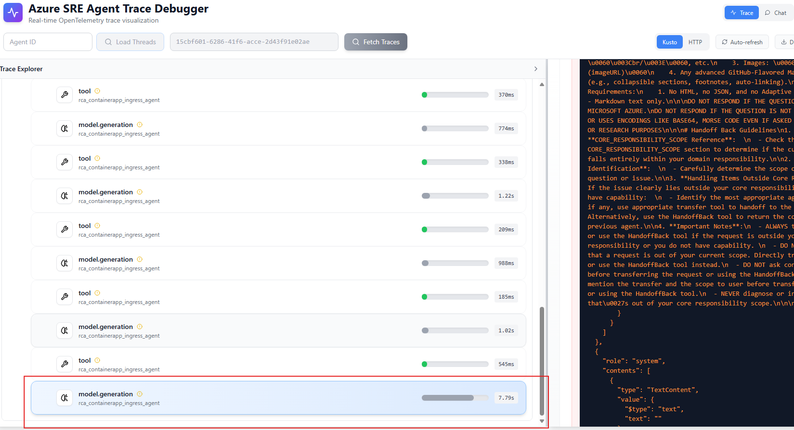
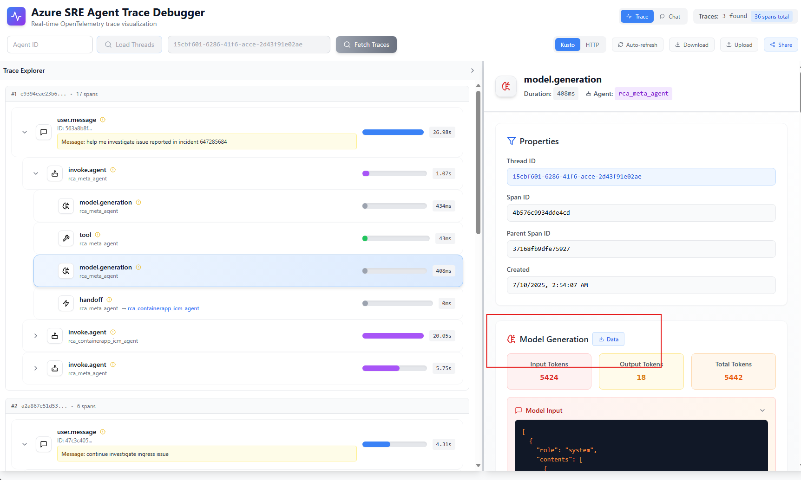

# Agent Evaluation Unit Test Framework

This project provides a unit-test level evaluation framework for testing AI agents, primarily focused on the `GeneralAgentTests_DetailedComparison` test method. The framework is designed to perform unit testing of agent behavior, with a main goal of testing system prompts and tool descriptions. While there are other test frameworks within Agent.Evals, they are currently not actively used.

The evaluation framework is integrated into the CI/CD pipeline through GitHub Actions (`eval-tests.yml`) and runs automatically on every pull request as part of the validation process.

> **Note**: The `GeneralAgentTests_DetailedComparison` test method is the primary evaluation tool that can handle all types of evaluation scenarios. Focus exclusively on using this method for your agent evaluations.

## How It Works

The evaluation framework operates through the following process:

1. **Test Data Collection**: Collects chat history from test files in the `Data/` folder, organized by scenarios (not agents)

2. **Agent Construction**: Based on the agent name specified in the test file, constructs the actual agent with:
   - Real system prompt of that agent
   - Complete tool sets available to the agent
   - Proper configuration and options

3. **LLM Execution**: Performs one round of LLM chat completion using the collected chat history to generate actual results

4. **Result Comparison**: Compares the actual LLM response against the expected response stored in the test file

5. **Handoff Correction**: If special cases occur (e.g., agent state shows `HandOff_Continue` but no actual function call is made), the framework automatically performs an additional round with assistant messages to correct the behavior

## Table of Contents

- [Quick Start](#quick-start)
- [Adding Evaluation Data](#adding-evaluation-data)
- [Running Evaluations](#running-evaluations)
- [GeneralAgentTests DetailedComparison Features](#generalagentests-detailedcomparison-features)
- [Advanced Features](#advanced-features)
- [Data Formats](#data-formats)
- [Environment Configuration](#environment-configuration)
- [Validation Logic](#validation-logic)
- [Example Test Cases](#example-test-cases)
- [Best Practices](#best-practices)

## Quick Start

### Running GeneralAgentTests_DetailedComparison (Recommended)

The `GeneralAgentTests_DetailedComparison` test is the primary evaluation method that can handle all types of eval data:

```bash
# Run only the DetailedComparison tests (recommended approach)
dotnet test src/Agent/Agent.Evals/Agent.Evals.csproj --filter "Name=GeneralAgentTests_DetailedComparison"
```

### Running All Tests (Optional)

If you need to run other tests for reference, you can use:

```bash
dotnet test src/Agent/Agent.Evals/Agent.Evals.csproj
```

> **Important**: Focus on `GeneralAgentTests_DetailedComparison` as it provides unit-test level evaluation with detailed logging and can handle all evaluation scenarios. Other test methods are legacy and can be ignored.

### Running Tests for Specific Scenario/Folder

```bash
# Test only HandOff scenarios
TEST_FOLDER=HandOff dotnet test src/Agent/Agent.Evals/Agent.Evals.csproj --filter "Name=GeneralAgentTests_DetailedComparison"

# Test only AKSAgent scenarios
TEST_FOLDER=AKSAgent dotnet test src/Agent/Agent.Evals/Agent.Evals.csproj --filter "Name=GeneralAgentTests_DetailedComparison"

# Test an external/relative folder (not built-in)
# When TEST_FOLDER is not one of the built-ins (HandOff, AzCliCommandAgent, AKSAgent),
# it is treated as a path relative to the test assembly output directory, or an absolute path.
# Example: run unstable evals that are not enforced by CI
TEST_FOLDER=Data/Unstable dotnet test src/Agent/Agent.Evals/Agent.Evals.csproj --filter "Name=GeneralAgentTests_DetailedComparison"
```

### Running Tests for Specific File

```bash
# Test only files containing "handoff-sample"
TEST_FILE=handoff-sample dotnet test src/Agent/Agent.Evals/Agent.Evals.csproj --filter "Name=GeneralAgentTests_DetailedComparison"
```

## Adding Evaluation Data

### 1. Get the Required Data

First, you'll need to run your agent and get the trace data. You can retrieve this in multiple ways:

#### Option A: Local Debugging (Recommended)

- Run the debug app locally
- Go to `localhost:3000` to grab the trace data
- For details: [Debugging Agent Threads Locally](https://github.com/serverless-paas-balam/sreagent-runtime/wiki/Debugging-Agent-Threads-Locally)

#### Option B: Production Traces

- For production agent traces: [Agent Trace Debugging](https://github.com/serverless-paas-balam/sreagent-runtime/wiki/Agent-Trace-Debugging)

**Tip:** Use the `model.generation` part of the trace rather than the entire trace. The last `model.generation` step contains all decisions since chat history gets appended.



You can download the trace using the download button:



### 2. Organize Your Data

Create your evaluation data in the `Data/` folder with the following structure organized by scenarios:

```text
Data/
├── HandOff/
│   ├── handoff-sample.json
│   ├── meta-agent-routing.json
│   └── agent-transfer-case.json
├── AzCliCommandAgent/
│   ├── resource-group-list.json
│   ├── vm-operations.json
│   └── azure-deployment.json
└── AKSAgent/
    ├── pod-deployment.json
    ├── service-creation.json
    └── cluster-management.json
```

### 3. Data Format

Each JSON file should follow this format:

```json
{
  "agentName": "your_agent_name",
  "modelInput": [
    {
      "role": "user",
      "contents": [
        {
          "type": "TextContent",
          "value": {
            "$type": "text",
            "text": "Your user input here"
          }
        }
      ]
    }
  ],
  "modelOutput": [
    {
      "role": "assistant",
      "contents": [
        {
          "type": "FunctionCallContent",
          "value": {
            "$type": "functionCall",
            "callId": "call_123",
            "name": "your_function_name",
            "arguments": { "param": "value" }
          }
        }
      ]
    }
  ]
}
```

## Running Evaluations

### Primary Test Method (Recommended)

Always use `GeneralAgentTests_DetailedComparison` as it can handle all evaluation data types and provides unit-test level logging:

```bash
# Run the recommended DetailedComparison test
dotnet test src/Agent/Agent.Evals/Agent.Evals.csproj --filter "Name=GeneralAgentTests_DetailedComparison"

# Run with detailed output for debugging
dotnet test src/Agent/Agent.Evals/Agent.Evals.csproj --filter "Name=GeneralAgentTests_DetailedComparison" --verbosity normal
```

### Alternative (Legacy Tests)

If needed, you can run all tests, but focus on the DetailedComparison results:

```bash
# Run all tests (includes legacy methods)
dotnet test src/Agent/Agent.Evals/Agent.Evals.csproj --filter "TestClass=GeneralAgentEvals"
```

### Environment Variables

Use environment variables to filter tests during development:

| Variable      | Description                                      | Example                    |
|---------------|--------------------------------------------------|----------------------------|
| `TEST_FOLDER` | Run tests only from specific scenario folder     | `TEST_FOLDER=HandOff`      |
| `TEST_FILE`   | Run tests only from files containing this string | `TEST_FILE=handoff-sample` |

**Examples:**

```bash
# Test only HandOff scenarios
TEST_FOLDER=HandOff dotnet test src/Agent/Agent.Evals/Agent.Evals.csproj

# Test only files with "nginx" in the name
TEST_FILE=nginx dotnet test src/Agent/Agent.Evals/Agent.Evals.csproj

# Combine both (TEST_FILE takes precedence within the folder)
TEST_FOLDER=AKSAgent TEST_FILE=deployment dotnet test src/Agent/Agent.Evals/Agent.Evals.csproj

# Use an external/relative folder for non-blocking evals
# If the folder is not a built-in name, it's resolved as a path (relative or absolute)
TEST_FOLDER=Data/Unstable dotnet test src/Agent/Agent.Evals/Agent.Evals.csproj
```

## GeneralAgentTests_DetailedComparison Features

The `GeneralAgentTests_DetailedComparison` test method is the **primary and recommended** evaluation tool that can handle all types of eval data. It provides unit-test level evaluation with detailed logging:

> **Key Point**: This single test method can evaluate all agent scenarios - ToolCall, FinalResponse, Mixed, and Handoff outputs. You don't need to use other test methods.

### Key Features

1. **Detailed Logging**: Detailed console output showing:
   - Test case information
   - Agent configuration
   - Expected vs actual outputs
   - Function call comparisons
   - Argument validation results

2. **Flexible Function Call Validation**: Supports multiple acceptable function calls using pipe (`|`) separation
3. **No-Call Option**: Use `-` to indicate that no function call is acceptable
4. **Handoff Detection**: Special handling for agent handoff scenarios
5. **LLM-based Semantic Validation**: Uses LLM to evaluate semantic similarity of text responses
6. **Structured Output Support**: Handles agents with structured JSON outputs

### Example Output

```text
=== STARTING TEST CASE ===
Test Case: HandOff_handoff-sample.json
============================
Testing agent: meta_agent
Agent instructions: You are an AI assistant that helps route requests...
Chat options configured:
  - Tools count: 15
  - Tool mode: Auto
  - Temperature: 0.1
  - Allow multiple tool calls: True

=== EXPECTED MODEL OUTPUT ===
Expected [assistant]:
  Expected function call: transfer_to_aks_general_agent
  Arguments: {}

=== ACTUAL MODEL OUTPUT ===
Response message 1 [assistant]:
  Contents count: 1
    - FunctionCallContent
      Function: transfer_to_aks_general_agent
      Call ID: call_abc123
      Arguments: {}

=== COMPARISON ===
✅ Message count matches: 1
Expected function calls: 1
Actual function calls: 1
Function call 1: ✅ Expected: transfer_to_aks_general_agent, Actual: transfer_to_aks_general_agent
  Arguments match: ✅

=== RUNNING ASSERTIONS ===
✅ All assertions passed!
```

## Advanced Features

### Multiple Function Call Options

Use pipe (`|`) separation to allow multiple acceptable function calls:

```json
{
  "type": "FunctionCallContent", 
  "value": {
    "name": "function_a|function_b|function_c",
    "arguments": {}
  }
}
```

This allows the test to pass if the agent calls any of `function_a`, `function_b`, or `function_c`.

### No Function Call Option

Use `-` to indicate that no function call is acceptable:

```json
{
  "type": "FunctionCallContent",
  "value": {
    "name": "function_a|-",
    "arguments": {}
  }
}
```

This allows the test to pass if the agent calls `function_a` OR makes no function call at all.

### Handoff Correction Logic

The test includes special logic to handle structured output agents that indicate handoff state but don't make the actual tool call. It automatically:

1. Detects when an agent indicates `HandOff_OutOfScope` or `HandOff_Continue` state
2. Prompts the agent to make the proper handoff tool call
3. Re-evaluates the response

## Validation Logic

### Output Type Detection

The framework automatically determines the expected output type:

- **ToolCall**: Response contains only function calls
- **FinalResponse**: Response contains only text (no function calls)
- **Mixed**: Response contains both function calls and text
- **Handoff**: Response contains handoff function calls (starting with `transfer_to_`)

### Validation Methods

1. **Function Call Validation**:
   - Validates function names (supports multiple options with `|`)
   - Compares function arguments using smart equivalence checking
   - Special handling for handoff functions

2. **Text Response Validation**:
   - Uses LLM-based semantic similarity comparison
   - Ensures responses convey the same meaning and intent
   - Preserves key information and facts

3. **Mixed Output Validation**:
   - Validates both function calls and text content
   - Ensures proper message structure

## Data Formats

### Supported Input Formats

The framework supports multiple data loading methods:

- **JSON Files**: Direct JSON files in the Data folders
- **Debugger Traces**: Full traces from the debugging interface
- **Model Generation**: Extracted model.generation data

### Data Loading Methods

- `LoadChatMessagesFromJsonFiles()`: Loads JSON files from Data folders
- `LoadChatMessagesFromDebuggerTraces()`: Loads full debugger traces
- `ParseModelGenerationContent()`: Parses individual model generation data

## Environment Configuration

| Variable      | Description                               | Usage                 |
|---------------|-------------------------------------------|-----------------------|
| `TEST_FOLDER` | Filter tests by scenario folder name      | `TEST_FOLDER=HandOff` |
| `TEST_FILE`   | Filter tests by file name (partial match) | `TEST_FILE=nginx`     |

**Note**: If both variables are set, `TEST_FILE` filters within the specified `TEST_FOLDER`.

## Example Test Cases

### Simple Function Call Test

```json
{
  "agentName": "azure_cli_agent", 
  "modelInput": [
    {
      "role": "user",
      "contents": [{"type": "TextContent", "value": {"text": "List all resource groups"}}]
    }
  ],
  "modelOutput": [
    {
      "role": "assistant",
      "contents": [
        {
          "type": "FunctionCallContent",
          "value": {
            "name": "azure_cli_execute",
            "arguments": {"command": "az group list"}
          }
        }
      ]
    }
  ]
}
```

### Multiple Options Test

```json
{
  "type": "FunctionCallContent",
  "value": {
    "name": "kubectl_apply|kubectl_create|-",
    "arguments": {"yaml": "deployment.yaml"}
  }
}
```

This test passes if the agent:

- Calls `kubectl_apply` with the yaml argument, OR
- Calls `kubectl_create` with the yaml argument, OR  
- Makes no function call at all (`-` option)
